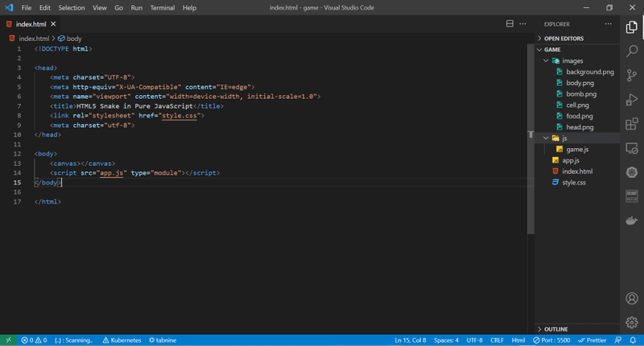
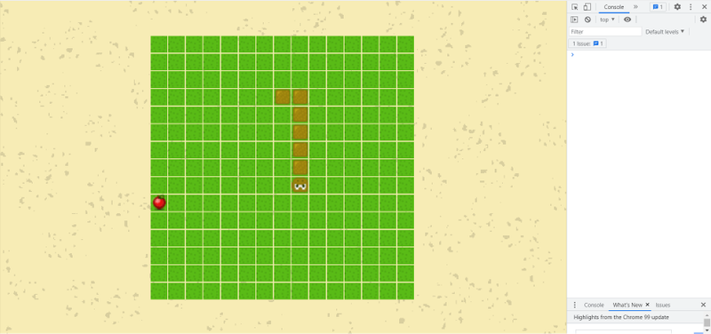

In this article, we will develop the classic Snake game using pure JavaScript. Snake is a simple game where a snake moves around a board, eating apples. As the snake eats apples, it grows longer. Additionally, we'll introduce a new feature: bombs. If the snake touches a bomb, it will die.

Experience the classic Snake game in action! Watch as the snake navigates the board, collects food, and grows longer. Test your skills and see how high you can score in this engaging [demo](https://jsdevspace.github.io/snake-js/). Dive in and enjoy the nostalgic gameplay!

You can download the assets, and sounds files from [Google Drive](https://drive.google.com/file/d/1KEIUtgGC8RJ-mAPx_x9H8gD-vFOvtLCx/view). View the full code on [github](https://github.com/jsdevspace/snake-js).

## Step 1: Setting Up the Skeleton for Your Snake Game

Let’s kick off the game development by creating the basic skeleton:

1. Download all necessary game assets from [here](https://drive.google.com/file/d/1KEIUtgGC8RJ-mAPx_x9H8gD-vFOvtLCx/view) and store them in a folders named **images**, and **sounds**.
2. Create an **index.html** file, adding standard HTML structure while linking to **style.css** and **app.js**.
3. Your index.html file should resemble the following structure:

```html
<!DOCTYPE html>
<head>
    <meta charset="UTF-8">
    <meta http-equiv="X-UA-Compatible" content="IE=edge">
    <meta name="viewport" content="width=device-width, initial-scale=1.0">
    <title>HTML5 Snake in Pure JavaScript</title>
    <link rel="stylesheet" href="style.css">
    <meta charset="utf-8">
</head>
<body>
    <canvas></canvas>
    <script src="app.js" type="module"></script>
</body>
</html>
```

Pay special attention to how we included the **app.js** file:

```html
<script src="app.js" type="module"></script>
```

We are connecting our main JavaScript file (**app.js**) with the `type="module"` attribute. This allows us to use imports of other JavaScript files into our app.js. In other words, other JavaScript files will be imported here, and we won’t need to reference them in **index.html**.

Now, let's create a **style.css** file and add some styles:

```css
* {
  padding: 0;
  margin: 0;
  box-sizing: border-box;
}
body {
  background-color: #e7dda9;
  text-align: center;
}
canvas {
  width: 100%;
  position: absolute;
  top: 50%;
  left: 50%;
  transform: translate(-50%, -50%);
  -o-transform: translate(-50%, -50%);
  -ms-transform: translate(-50%, -50%);
  -moz-transform: translate(-50%, -50%);
  -webkit-transform: translate(-50%, -50%);
}
```

With the help of CSS, we centered our canvas and added a background color of `#E7DDA9`. You can choose any other color, but this one matches the color of our background sprite.

All that's left is to create a **js** folder, add a **game.js** file to it, and connect it in our main **app.js** file:

```js
/// app.js
import Game from './js/game.js';

import Game from './js/game.js';
```

In the **game.js** file, which is located in the js folder, we will insert an empty class with an export for now.

```js
export default class Game {
  constructor() {}
}
```

Moving forward, we'll only be modifying the files within the `js` folder. The files in the main folder (**index.html, style.css, app.js**) will remain unchanged.

The final structure of our initial template should look like the image provided.



## Step 2: Canvas Initialization and Background Rendering

In the Game class, we will create two methods: `init()` and `create()`, and call them in the constructor.

```js
export default class Game {
  constructor() {
    this.init();
    this.create();
  }
  init() {}
  create() {}
}
```

In the `init()` method, as you might have guessed, we will initialize all the necessary variables for the class, and in the `create()` method, we will create our entities. First, let's initialize the canvas.

```js
init() {
    // Connect the canvas
    this.canvas = document.querySelector('canvas');
    // Get the context
    this.context = this.canvas.getContext('2d');
    // Set the width and height
    this.context.canvas.width = 640;
    this.context.canvas.height = 360;
    // Define the center of the screen
    this.centerX = this.context.canvas.width / 2;
    this.centerY = this.context.canvas.height / 2;
}
```

In the code above, we initialized the Canvas, acquired the Canvas context, set its height and width, and saved the center coordinates in the variables `centerX` and `centerY`.

Next, we'll display the background. To accomplish this, we will create a new method called createBg and invoke it from the `create()` function.

```js
create() {
    this.createBg();
}
createBg() {
}
```

To display the background on the Canvas, we need to:

1. Create a new image using the JavaScript method `new Image()`.
2. Set the image's src property to the path of our background image.
3. Attach an event listener for the load event to ensure the image has fully loaded.
4. Render the background on the Canvas.

Here's how this looks in code:

```js
createBg() {
    // Create a new image and set its path
    this.bg = new Image();
    this.bg.src = '../images/background.png';
    // Listen for the load event
    this.bg.addEventListener('load', () => {
        // Redraw the page
        window.requestAnimationFrame(() => {
            // Draw the background
            this.context.drawImage(this.bg, 0, 0);
        });
    });
}
```

After loading the image, we call the `requestAnimationFrame()` function to notify the browser that it needs to redraw the page before executing the code in the callback function. In this callback, we draw our background on the canvas context using the `drawImage()` method, to which we pass the image and the X and Y coordinates. In this example, we position the image at coordinates (0, 0), which means it will be displayed in the top-left corner. Since we centered our canvas on the page (in the `style.css` file), the image will appear in the middle of the screen.

The result of our work in the browser looks like this:


We just need to organize a `preload()` method in which we'll load all the images. After all, we don’t want to create a new `Image()` for each sprite, set the src, and track the loading process each time. Instead, we’ll extract this code into a separate method to load all the necessary images for the game at once.

Let's create the `preload()` method and add it to the constructor:

```js
constructor() {
    this.init();
    this.preload();
    this.create();
}
preload() {}
```

We'll also divide the preloader into methods. For now, there will be just one method - `preloadImages()`, but we plan to add more methods to it in the future.

```js
preload() {
    this.preloadImages();
}
preloadImages(){
}
```

Now we need to create the `preloadImages()` method. This method will accept a path along with X and Y coordinates, then create our sprite and return the image. This approach will allow us to store the necessary sprites in the class's global variables using the `this` context.

```js
preloadImages() {
    this.background = this.preloadImage('../images/background.png', 0, 0);
}
preloadImage(path, x, y) {
    let image = new Image();
    image.src = path;
    image.addEventListener('load', () => {
        window.requestAnimationFrame(() => {
            this.context.drawImage(image, x, y);
        });
    });
    return image;
}
```

We can remove the `create()` and `createBg()` methods. The `preloadImages()` function still needs some refinement, specifically adding asynchronous functionality. The simplest way to ensure that all assets are fully loaded is to use a Promise. Here's how our code will look with the Promise implementation:

```js
async preloadImage(path, x, y) {
    let image = new Image();
    await new Promise((resolve, reject) => {
        image.src = path;
        image.addEventListener('load', () => {
            // If the asset has loaded, draw it
            window.requestAnimationFrame(() => {
                this.context.drawImage(image, x, y);
            });
            // Return the image
            resolve(image);
        });
        image.addEventListener('error', () => {
            // If there's an error, throw the error into reject
            reject(new Error("Couldn't load image"));
        });
    });
    // Return the image
    return image;
}
```

We added a standard Promise and handled errors by incorporating an 'error' event listener. Additionally, we included the `async` keyword before the function name. Now, we need to modify the `preloadImages()` function by also adding `async`, which will allow us to use the await operator. This way, we can retrieve the image path string just like we did before. If we omit await, the `preloadImage()` method will return a Promise instead.

```js
async preloadImages() {
    this.background = await this.preloadImage(
        '../images/background.png',
        0,
        0,
    );
}
```

To make the `preloadImage()` function more versatile, we will add default values for X and Y.

```js
async preloadImage(path, x = -100, y = -100) {
    ...
}
```

This will allow us to load assets without specifying absolute coordinates. We passed -100 as the argument to ensure that the sprites remain hidden on the canvas.

Let’s test our new method by adding another image, **cell.png**, and displaying it at the coordinates `centerX` and `centerY`.

```js
async preloadImages() {
    this.background = await this.preloadImage(
        '../images/background.png',
        0,
        0,
    );
    this.cell = await this.preloadImage(
        '../images/cell.png',
        this.centerX,
        this.centerY,
    );
}
```

If you see two images on the screen, everything is working fine! If not, please check the code. Here’s what our entire `Game` class looks like now:

```js
export default class Game {
  constructor() {
    this.init();
    this.preload();
  }
  init() {
    this.canvas = document.querySelector('canvas');
    this.context = this.canvas.getContext('2d');
    this.context.canvas.width = 640;
    this.context.canvas.height = 360;
    this.centerX = this.context.canvas.width / 2;
    this.centerY = this.context.canvas.height / 2;
  }
  preload() {
    this.preloadImages();
  }
  async preloadImages() {
    this.background = await this.preloadImage('../images/background.png', 0, 0);
    this.cell = await this.preloadImage('../images/cell.png');
  }
  async preloadImage(path, x, y) {
    let image = new Image();
    await new Promise((resolve, reject) => {
      image.src = path;
      image.addEventListener('load', () => {
        window.requestAnimationFrame(() => {
          this.context.drawImage(image, x, y);
        });
        resolve(image);
      });
      image.addEventListener('error', () => {
        reject(new Error("Couldn't load image"));
      });
    });
    return image;
  }
}
```

## Step 3: Creating a Board Matrix

Our game board will consist of two entities: the controller and the model. In the `js` folder, we will create two new folders: `models` and `controllers`. Inside the `models` folder, we will create a file called **board.js** to define our board:

```js
export default class Board {
  constructor() {
    this.init();
    this.create();
  }

  init() {
    // Initialize an empty array that we will fill later
    this.cells = [];
    // Board width
    this.boardWidth = 15;
    // Board height
    this.boardHeight = 15;
  }

  create() {
    // Loop through the width
    for (let x = 0; x < this.boardWidth; x++) {
      // Loop through the height
      for (let y = 0; y < this.boardHeight; y++) {
        // Add the cell coordinates to the array
        this.cells.push({ x, y });
      }
    }
  }
}
```

We have already established the familiar `init()` and `create()` methods, which we call within the constructor. In the `init()` method, we initialize our cell array as well as the width and height of the matrix (feel free to experiment with the dimensions). In the `create()` function, we populate our array with X and Y coordinates. These are not the final coordinates, but rather the indices of the cells. We will handle all the logic of our board in the controller, where we will calculate the exact coordinates. This way, we completely isolate the logic from the model.

### Creating the Board Controller

```js
import Board from './../models/board.js';

import Board from './../models/board.js';

export default class BoardController {
  constructor(context, cell) {
    this.init();
    this.render(context, cell);
  }
  init() {
    this.board = new Board();
  }
  render(context, cell) {}
}
```

In the `boardController.js` file, which we created in the `controllers` folder, we import our board and render it. To render the board, we will need the canvas context and the cell sprite, which we will pass to the constructor from the **game.js** file. We will then forward these arguments to the `render()` method.

Now, let’s proceed to draw all the cells:

```js
render(context, cell) {
    // Add one pixel to the width and height of the sprite for padding
    const cellWidth = cell.width + 1;
    const cellHeight = cell.height + 1;
    // Iterate over the array of cells
    this.board.cells.forEach((cellCoords) => {
        window.requestAnimationFrame(() => {
            context.drawImage(
                cell,
                // Multiply the cell index by the width
                cellCoords.x * cellWidth,
                // Multiply the cell index by the height
                cellCoords.y * cellHeight,
            );
        });
    });
}
```

We have created a board with cells, and now we need to integrate it into the Game class. This should be done after all sprites have been loaded. To keep things simple and avoid wrapping the loading code in another Promise, we'll simply call the `create()` method at the end of the `preloadImages()` function. Within the `create()` method, we will instantiate our Board Controller and store it in a variable.

```js
this.boardController = new BoardController(this.context, this.cell);
```

Next, we need to pass the necessary arguments (context and cell) and import the `boardController.js` file from the controllers folder.

In the browser, our board now appears as follows:


To draw our board in the center, we need to calculate `offsetX` and `offsetY`.

```js
const offsetX = (context.canvas.width - cellWidth * this.board.boadWidth) / 2;
```

Here, we subtract the total width of the board (cell width multiplied by the number of cells) from the canvas width and divide by two.

```js
const offsetY =
  (context.canvas.height - cellHeight * this.board.boadHeight) / 2;
```

We do the same calculation for the height, subtracting the total height of the board from the canvas height and dividing by two.

Now we need to add these offsets to both sides.

```js
render(context, cell) {
    const cellWidth = cell.width + 1;
    const cellheight = cell.height + 1;
    const offsetX =
        (context.canvas.width - cellWidth * this.board.boadWidth) / 2;
    const offsetY =
        (context.canvas.height - cellheight * this.board.boadHeight) / 2;
    this.board.cells.forEach((cellCoords) => {
        window.requestAnimationFrame(() => {
            context.drawImage(
                cell,
                cellCoords.x * cellWidth + offsetX,
                cellCoords.y * cellheight + offsetY,
            );
        });
    });
}
```

And our board will be centered.


Here’s how the entire `boardController.js` file looks now.

```js
import Board from './../models/board.js';

import Board from './../models/board.js';

export default class BoardController {
  constructor(context, cell) {
    this.init();
    this.render(context, cell);
  }
  init() {
    this.board = new Board();
  }
  render(context, cell) {
    const cellWidth = cell.width + 1;
    const cellheight = cell.height + 1;
    const offsetX =
      (context.canvas.width - cellWidth * this.board.boadWidth) / 2;
    const offsetY =
      (context.canvas.height - cellheight * this.board.boadHeight) / 2;
    this.board.cells.forEach(cellCoords => {
      window.requestAnimationFrame(() => {
        context.drawImage(
          cell,
          cellCoords.x * cellWidth + offsetX,
          cellCoords.y * cellheight + offsetY
        );
      });
    });
  }
}
```

## Step 4: Limiting the Canvas Size

After creating our matrix, we need to set limits on the maximum and minimum sizes of our canvas. This ensures that our board is always fully rendered and not cut off. In the Game class, we will rename the `width` and `height` variables to `maxWidth` and `maxHeight` in the init method. Then, after creating the `boardController` in the create method, we will call a new function called `resizeCanvas`.

```js
create() {
    this.boardController = new BoardController(this.context, this.cell);
    this.resizeCanvas();
}
resizeCanvas() {
    ...
}
```

In the `resizeCanvas()` method, we will calculate the new height and width for the canvas. First, we need to set the minimum values. To ensure that our board is always fully rendered, the minimum width will be equal to the board's width, and the minimum height will correspond to the board's height. Here's how this looks in code:

```js
this.minWidth =
  (this.boardController.board.boadWidth + 1) * (this.cell.width + 1);
this.minHeight =
  (this.boardController.board.boadHeight + 1) * (this.cell.height + 1);
```

As before, we add one pixel for padding. Now, let's calculate the width, as the height of the board will depend on this value.

```js
this.width = Math.floor(
  (window.innerWidth * this.maxHeight) / window.innerHeight
);
this.width = Math.min(this.width, this.maxWidth);
this.width = Math.max(this.width, this.minWidth);
```

In the code above, we calculate the width three times. First, we determine the ratio between the current width and the maximum height based on the current height. Second, we use the `Math.min()` method to ensure that the width does not exceed the maximum limit. Finally, we check that the width is not less than the minimum value; if it is, we set it to the minimum.

Now, let's calculate the height:

```js
this.height = Math.floor((this.width * window.innerHeight) / window.innerWidth);
```

Once we have computed the new height and width, we can assign these values to our canvas:

```js
this.context.canvas.width = this.width;
this.context.canvas.height = this.height;
```

You can remove those lines from the `init()` method now. Next, we need to separate our width and height calculation method. Depending on whether our screen is narrower or wider, we will stretch the canvas in width or height. To achieve this, we will create two new methods: `fitWidth()` and `fitHeight()`.

```js
resizeCanvas() {
    this.minWidth =
        (this.boardController.board.boadWidth + 1) * (this.cell.width + 1);
    this.minHeight =
        (this.boardController.board.boadHeight + 1) *
        (this.cell.height + 1);
    // Определяем экран шире или уже
    if (
        window.innerWidth / window.innerHeight >
        this.maxWidth / this.maxHeight
    ) {
        this.fitWidth();
    } else {
        this.fitHeight();
    }
    this.context.canvas.width = this.width;
    this.context.canvas.height = this.height;
    this.drawBackground();
    this.boardController &&
        this.boardController.render(this.context, this.cell);
}
fitWidth() {
    this.height = Math.round(
        (this.width * window.innerHeight) / window.innerWidth,
    );
    this.height = Math.min(this.height, this.maxHeight);
    this.height = Math.max(this.height, this.minHeight);
    this.width = Math.round(
        (window.innerWidth * this.height) / window.innerHeight,
    );
    this.canvas.style.width = '100%';
}
fitHeight() {
    this.width = Math.round(
        (window.innerWidth * this.maxHeight) / window.innerHeight,
    );
    this.width = Math.min(this.width, this.maxWidth);
    this.width = Math.max(this.width, this.minWidth);
    this.height = Math.round(
        (this.width * window.innerHeight) / window.innerWidth,
    );
    this.canvas.style.height = '100%';
}
```

All that’s left is to redraw our background and re-render our matrix. Let’s create a method called `drawBackground()` and place it above the `resizeCanvas()` method.

```js
drawBackground() {
    this.context.drawImage(
        this.background,
        (this.width - this.background.width) / 2,
        (this.height - this.background.height) / 2,
    );
}
```

Previously, we drew the background at coordinates 0, 0. Now, we dynamically calculate the center with an offset, allowing us to render the background in the center of the canvas.

In the `resizeCanvas()` method, we only need to call this function and notify the `BoardController` class to render the matrix with the new data.

```js
this.drawBackground();
// Ensure that boardController is already created
this.boardController && this.boardController.render(this.context, this.cell);
```

Earlier, we called the `render()` method in the constructor of the `BoardController` class, but this call can now be removed.

We also need to make a few adjustments to our CSS, specifically:

- Remove the property `width: 100%`;
- Add the property `image-rendering: pixelated`;

Here’s how the **style.css** file looks now:

```css
* {
  padding: 0;
  margin: 0;
  box-sizing: border-box;
}
body {
  background-color: #e7dda9;
  text-align: center;
}
canvas {
  position: absolute;
  top: 50%;
  left: 50%;
  image-rendering: pixelated;
  transform: translate(-50%, -50%);
  -o-transform: translate(-50%, -50%);
  -ms-transform: translate(-50%, -50%);
  -moz-transform: translate(-50%, -50%);
  -webkit-transform: translate(-50%, -50%);
}
```

We won't be making any further changes to it.

## Step 5: Creating the Snake

Let's start by loading the images using the `preloadImages()` method in the `Game` class.

```js
this.snakeBody = await this.preloadImage('../images/body.png');
this.snakeHead = await this.preloadImage('../images/head.png');
```

Next, we'll create the **snake.js** model and the **snakeController.js** controller in the `models` and `controllers` folders, respectively. In the `Snake` class, we will initially call empty `init()` and `create()` methods, while in the `SnakeController` class, we will call `init()` and `render()`, similar to how we created the model and controller for the board.

In the model for our snake, we will initialize two arrays. One array will store the initial coordinates, while the other will remain empty.

```js
export default class Snake {
  constructor() {
    this.init();
    this.create();
  }
  init() {
    this.snakeCoords = [];
    this.snakeStartCoords = [
      { x: 3, y: 12 },
      { x: 3, y: 13 },
    ];
  }
  create() {}
}
```

The `snakeCoords` array will be populated later, and the create method will remain empty for now, as we might not need it at all.

Now, let's move on to the `SnakeController` class. Here, we need to pass the canvas context, `boardController`, and the sprites for the snake's head and body. In the `init()` method, we will create the snake model right away.

```js
// Importing the Snake model
import Snake from '../models/snake.js';

export default class SnakeController {
    constructor(context, boardController, snakeBody, snakeHead) {
        this.init(boardController);
        // Passing all arguments directly to the render method
        this.render(context, boardController, snakeBody, snakeHead);
    }

    init(boardController) {
        // Initializing the Snake model
        this.snake = new Snake();
    }

    render(context, boardController, snakeBody, snakeHead) {
        ...
    }
}
```

In the `init()` method, we need to determine the coordinates of our snake. To achieve this, we'll make some enhancements to our `BoardController`. It's most efficient to calculate these coordinates there since we'll be rendering all objects on top of our grid. We'll create a method called `getCell(x, y)` that will return the cell on our board. This way, all calculations related to offsets, width, and height will be contained within a single class.

```js
getCell(x, y) {
    return this.board.cells.find((c) => c.x === x && c.y === y);
}
```

Let's return to our `SnakeController` and focus on the `init()` method. Now, we'll find the necessary coordinates for the snake and store them in the empty (for now) `snakeCoords` array that we created in the `Snake` model. Here's how this looks in code:

```js
init(boardController) {
    this.snake = new Snake();

    for (let coord of this.snake.snakeStartCoords) {
        let cell = boardController.getCell(coord.x, coord.y);
        this.snake.snakeCoords.push(cell);
    }
}
```

In the code above, we iterate through the starting coordinates, identify them on the board, and add them to the coordinates array. Currently, the `snakeCoords` array should contain two objects with the snake's coordinates. We can verify that the array is being populated correctly with:

```js
console.log(this.snake.snakeCoords);
```

Now, let's move on to the `render()` method. Here, we need to iterate through all the coordinates of our snake and render them. We'll pass both the snake's body and its head to this method. We'll place the head in the array slot at index 0 and render the body in the remaining slots.

```js
render(context, boardController, snakeBody, snakeHead) {
    this.snake.snakeCoords.forEach((cell, i) => {
        window.requestAnimationFrame(() => {
            context.drawImage(
                // Определяем номер массива
                i === 0 ? snakeHead : snakeBody,
                // Высчитываем ширину с оффсетом
                cell.x * boardController.cellWidth +
                    boardController.offsetX,
                // Высчитываем длину с оффсетом
                cell.y * boardController.cellheight +
                    boardController.offsetY,
            );
        });
    });
}
```

Here is the complete `SnakeController` class:

```js
import Snake from '../models/snake.js';

import Snake from '../models/snake.js';

export default class SnakeController {
  constructor(context, boardController, snakeBody, snakeHead) {
    this.init(boardController);
    this.render(context, boardController, snakeBody, snakeHead);
  }
  init(boardController) {
    this.snake = new Snake();

    for (let coord of this.snake.snakeStartCoords) {
      let cell = boardController.getCell(coord.x, coord.y);
      this.snake.snakeCoords.push(cell);
    }
  }
  render(context, boardController, snakeBody, snakeHead) {
    this.snake.snakeCoords.forEach((cell, i) => {
      window.requestAnimationFrame(() => {
        context.drawImage(
          i === 0 ? snakeHead : snakeBody,
          cell.x * boardController.cellWidth + boardController.offsetX,
          cell.y * boardController.cellheight + boardController.offsetY
        );
      });
    });
  }
}
```

All that’s left is to call it in the **game.js** file and pass all the necessary arguments. We will do this in the create method:

```js
create() {
    this.boardController = new BoardController(this.context, this.cell);
    this.resizeCanvas();
    this.snake = new SnakeController(
        this.context,
        this.boardController,
        this.snakeBody,
        this.snakeHead,
    );
}
```

In the browser, we should see the snake.


## Step 6: Moving the Snake

To make our snake move, we need to enhance our `SnakeController` class. We will add the `move()` and `getNextCell()` methods, but first, let’s store our `BoardController` in the render method:

```js
this.boardController = boardController;
```

We will use this variable later, and since the `render()` method will be called on every frame, our `boardController` will also update its data.

Now, let’s create the `move()` method.

```js
move() {
    // Find the next cell
    let cell = this.getNextCell();
    if (cell) {
        // Add the cell to the beginning
        this.snake.snakeCoords.unshift(cell);
        // Remove the last cell
        this.snake.snakeCoords.pop();
    }
}
```

Now, in the `getNextCell()` method, we need to determine the new cell. For now, we will simply decrease the Y value by one, keeping the X value the same. We'll utilize the existing `getCell()` method that we created in the BoardController.

```js
getNextCell() {
    let head = this.snake.snakeCoords[0];
    return this.boardController.getCell(head.x, head.y - 1);
}
```

We will call the `move()` method from our Game class at an interval of 150 milliseconds. Additionally, before each canvas rendering, we need to clear it, redraw the background, then the board, and finally render the snake in its new coordinates. To accomplish this, we will create two new methods in the Game class: `start()` and `update()`. We will call the start method in the `create()` function after initializing all the necessary entities.

```js
this.start();
```

It will contain a `setInterval()` function, where we will call our `update()` method in the callback.

```js
start() {
    setInterval(() => {
        this.update();
    }, 150);
}
```

In the `update()` method, we will redraw the entire canvas with each move of the snake.

```js
update() {
    // Move the snake
    this.snakeController.move();
    // Clear the canvas
    this.context.clearRect(
        0,
        0,
        this.context.canvas.width,
        this.context.canvas.height,
    );
    // Draw the background
    this.drawBackground();
    // Redraw the board
    this.boardController.render(this.context, this.cell);
    // Redraw the snake
    this.snakeController.render(
        this.context,
        this.boardController,
        this.snakeBody,
        this.snakeHead,
    );
}
```

Now our snake can move!


We just need to learn how to stop the snake. We want the snake to start moving only after one of the keys is pressed. Therefore, we will add a flag `isMoving` to the snake model. Initially, it will be set to `false`. We'll add this in the `init()` method:

```js
this.isMoving = false;
```

In the `Snake` class, we also have an empty `create()` method. Let's rename it to `startMoving()` and update the boolean value in it:

```js
startMoving() {
    this.isMoving = true;
}
```

In the snake controller, we will prevent movement while the boolean `isMoving` is set to `false`. To do this, we'll add code at the very beginning of the `move()` method:

```js
if (!this.snake.isMoving) {
  return;
}
```

Let's go back to the `Game` class. We need to detect any key press and change the flag to `isMoving = true`. We will do this in the `create()` method. Before starting the game, we will set up our event listeners in a method called `createListeners()` and invoke it.

```js
this.createListeners();
```

```js
createListeners() {
    window.addEventListener('keydown', () => {
        this.snakeController.snake.startMoving();
    });
    this.start();
}
```

In the `createListeners()` function, we change the `isMoving` flag and start the game.

This approach will allow us to stop and start various objects in our scene in the future. While it might be possible to use a single global flag for the entire game in this small project, we will implement individual flags for all dynamic objects as a good practice.

Before we begin tracking the control buttons, we need to enable the snake to move in different directions. In the `SnakeController` class, we will introduce new variables, `deltaX` and `deltaY`, which will initially be set to zero. We will initialize them in the `init()` method.

```js
init(boardController) {
    this.deltaX = 0;
    this.deltaY = 0;
    ...
}
```

In the `getNextCell()` function, we will now simply add these values to the X and Y coordinates of the snake's head:

```js
getNextCell() {
    let head = this.snake.snakeCoords[0];
    return this.boardController.getCell(
        head.x + this.deltaX,
        head.y + this.deltaY,
    );
}
```

**Here’s how it works:**

If we set `deltaX` to 1, the snake will move to the right. With a value of -1, it will move to the left.

The same logic applies to `deltaY`. A value of 1 will make the snake move down, while -1 will make it move up, as it was set previously. Therefore, we will initially set the direction to upward:

```js
this.deltaX = 0;
this.deltaY = -1;
```

Now, let's return to the `Game` class and the `createListeners()` method. We need to detect which key is pressed and update the direction values accordingly. Here’s how this looks in code:

```js
window.addEventListener('keydown', e => {
  const { key } = e;
  if (key === 'ArrowUp') {
    this.snakeController.deltaX = 0;
    this.snakeController.deltaY = -1;
  } else if (key === 'ArrowDown') {
    this.snakeController.deltaX = 0;
    this.snakeController.deltaY = 1;
  } else if (key === 'ArrowLeft') {
    this.snakeController.deltaX = -1;
    this.snakeController.deltaY = 0;
  } else if (key === 'ArrowRight') {
    this.snakeController.deltaX = 1;
    this.snakeController.deltaY = 0;
  }
  this.snakeController.snake.startMoving();
});
```

Each time we set `deltaY`, we reset `deltaX` to zero, and vice versa. This ensures that our snake can only move in one direction at a time.

Now, our snake is capable of moving in all directions on the board.

## Stage 7: Adding Food for the Snake

Let’s start by adding the food sprite in the `preloadImages()` method of the Game class:

```js
this.food = await this.preloadImage('../images/food.png');
```

Next, we need to pass the food sprite to the `render()` method in the `BoardController`. We’ll add the sprite as an argument in the `update()` and `resizeCanvas()` methods:

```js
this.boardController.render(this.context, this.cell, this.food);
```

In the `render()` method, we'll accept the `food` argument, and we can clean up the constructor by removing all arguments. Now, we can initialize an empty `BoardController`:

```js
this.boardController = new BoardController();
```

Next, we'll call the `addFood()` function, which we haven’t created yet:

```js
this.boardController.addFood();
```

Now, let’s create the `addFood()` function.

```js
addFood() {
    let cell = this.board.cells[0];
    cell.hasFood = true;
}
```

In the code above, we retrieve the first cell of our board and mark it with `hasFood`. Now, we just need to check in the `render()` method whether the `hasFood` label is present and draw the food accordingly. Here’s the rendering code:

```js
if (cellCoords.hasFood) {
  context.drawImage(
    food,
    cellCoords.x * this.cellWidth + this.offsetX,
    cellCoords.y * this.cellheight + this.offsetY
  );
}
```

Only one argument has changed — the sprite. The entire `render()` method now looks like this:

```js
render(context, cell, food) {
    this.cellWidth = cell.width + 1;
    this.cellheight = cell.height + 1;
    this.offsetX =
        (context.canvas.width - this.cellWidth * this.board.boadWidth) / 2;
    this.offsetY =
        (context.canvas.height - this.cellheight * this.board.boadHeight) /
        2;
    this.board.cells.forEach((cellCoords) => {
        window.requestAnimationFrame(() => {
            context.drawImage(
                cell,
                cellCoords.x * this.cellWidth + this.offsetX,
                cellCoords.y * this.cellheight + this.offsetY,
            );
            if (cellCoords.hasFood) {
                context.drawImage(
                    food,
                    cellCoords.x * this.cellWidth + this.offsetX,
                    cellCoords.y * this.cellheight + this.offsetY,
                );
            }
        });
    });
}
```

If you followed all the steps correctly, you should see an apple in the top-left cell.


Naturally, we want to draw the food at random, free coordinates. To do this, we'll replace the line:

```js
let cell = this.board.cells[0];
```

with

```js
getAvailableCell(){
    return this.board.cells[0];
}
addFood() {
    let cell = this.getAvailableCell();
    cell.hasFood = true;
}
```

In the `getAvailableCell()` method, we will implement the logic for obtaining a free cell. However, we will actually create another function called `getRandomCell()`, where we will write the formula for generating a random number. Here's how it looks in code:

```js
getRandomCell(min, max) {
    return Math.floor(Math.random() * (max + 1 - min) + min);
}
```

Now we can obtain a random cell from our board.

```js
getAvailableCell() {
    let idx = this.getRandomCell(0, this.board.cells.length - 1);
    return this.board.cells[idx];
}
```

In the previously created `getRandomCell()` method, we pass 0 as the minimum number and `this.board.cells.length - 1` as the maximum.

The result:


We just need to check whether the snake is currently occupying the cell. To do this, we will pass the `SnakeController` to the `addFood()` method, and then we’ll pass it to the `getAvailableCell()` method.

```js
getAvailableCell(snakeController) {
    ...
}
addFood(snakeController) {
    let cell = this.getAvailableCell(snakeController);
    cell.hasFood = true;
}
```

Just to remind you, in the `SnakeController` class, we create the snake and store its coordinates in the `snakeCoords` array. Using the `filter` method, we can check if a cell is free from the snake. Here's how this looks in code:

```js
getAvailableCell(snakeController) {
    // Get an array of free cells
    const availableCells = this.board.cells.filter((cell) => {
        return !snakeController.snake.snakeCoords.includes(cell);
    });
    // Return a random cell from the new array
    let idx = this.getRandomCell(0, availableCells.length - 1);
    return availableCells[idx];
}
```

Now our board can render food while checking the coordinates against the snake. This ensures that we reliably render the food in a free cell.

## Stage 8: Snake Eating Food

The logic for eating food will be very simple. Each time the snake moves in the `move()` method of the `SnakeController` class, we will "trim" the snake's tail using the `pop()` method.

```js
move() {
    if (!this.snake.isMoving) {
        return;
    }
    let cell = this.getNextCell();
    if (cell) {
        this.snake.snakeCoords.unshift(cell);
        // Отрезаем змее хвост
        this.snake.snakeCoords.pop();
    }
}
```

All we need to do is reverse this action if the snake eats the food.

```js
if (cell) {
  this.snake.snakeCoords.unshift(cell);
  if (cell.hasFood) {
    // If the cell contains food, exit the method
    return;
  }
  this.snake.snakeCoords.pop();
}
```

Let’s enhance this method a bit. Specifically, we need to first remove the old apple and then render the new one.

```js
if (cell) {
  this.snake.snakeCoords.unshift(cell);
  if (cell.hasFood) {
    // Remove the eaten apple
    this.boardController.removeFood(cell);
    // Render a new apple
    this.boardController.addFood(this);
    return;
  }
  this.snake.snakeCoords.pop();
}
```

Now, let's create the `removeFood()` function in the `BoardController` class:

```js
removeFood(cell) {
    cell.hasFood = false;
}
```

Now, our snake can eat apples!



## Stage 9: Rotating the Snake's Head


We can implement the rotation of the snake's head using two methods:

1. Create four images facing different directions and switch between them based on the current direction.
2. Dynamically rotate the snake's head based on its movement.


In this simple game, we will use the second method. To implement this, we need to modify the `render()` method in the `SnakeController` class.

First, we’ll add a degree variable in the init method:

```js
this.degree = 180;
```

We set the default value to 180 so that the snake initially faces upward. We will later adjust the rotation of the snake's head by changing this value. To achieve this, we need to save the canvas context, rotate it, draw the head, and then restore the saved context.

Now, our `render()` method looks like this:

```js
render(context, boardController, snakeBody, snakeHead) {
    this.boardController = boardController;
    // Save half the width (which is also the height)
    const halfHeadSize = snakeHead.width / 2;
    this.snake.snakeCoords.forEach((cell, i) => {
        window.requestAnimationFrame(() => {
            // Find the head
            if (i === 0) {
                // Save the context
                context.save();
                // Move to the head's position
                context.translate(
                    cell.x * boardController.cellWidth + boardController.offsetX,
                    cell.y * boardController.cellheight + boardController.offsetY,
                );
                // Move to the center of the cell
                context.translate(halfHeadSize, halfHeadSize);
                // Rotate the context
                context.rotate((this.degree * Math.PI) / 180);
                // Draw the head
                context.drawImage(snakeHead, -halfHeadSize, -halfHeadSize);
                // Restore the context without rotations
                context.restore();
            } else {
                context.drawImage(
                    snakeBody,
                    cell.x * boardController.cellWidth + boardController.offsetX,
                    cell.y * boardController.cellheight + boardController.offsetY,
                );
            }
        });
    });
}
```

This method first saves the current context, then translates and rotates it according to the head's coordinates and rotation degree. After drawing the head, it restores the context, allowing the rest of the snake's body to be drawn without any transformations.

We will change the `degree` variable in the `createListeners()` method of the `Game` class. To make the snake look down, we set the value to 0; for up, it’s 180; for left, it’s 90 degrees; and for right, it’s 270. The entire method code now looks like this:

```js
createListeners() {
    window.addEventListener('keydown', (e) => {
        const { key } = e;
        if (key === 'ArrowUp') {
            this.snakeController.deltaX = 0;
            this.snakeController.deltaY = -1;
            this.snakeController.degree = 0;
        } else if (key === 'ArrowDown') {
            this.snakeController.deltaX = 0;
            this.snakeController.deltaY = 1;
            this.snakeController.degree = 180;
        } else if (key === 'ArrowLeft') {
            this.snakeController.deltaX = -1;
            this.snakeController.deltaY = 0;
            this.snakeController.degree = 270;
        } else if (key === 'ArrowRight') {
            this.snakeController.deltaX = 1;
            this.snakeController.deltaY = 0;
            this.snakeController.degree = 90;
        }
        this.snakeController.snake.startMoving();
    });
    this.start();
}
```

The head of our snake can now turn in all directions.


## Stage 10: Rendering Bombs

As always, let's start by adding our sprite. In the `Game` class, within the `preloadImages()` method, we will add the following line:

```js
this.bomb = await this.preloadImage('../images/bomb.png');
```

Next, in the `create()` method, we'll call the function `addBomb()`, which we haven't created yet:

```js
this.boardController.addBomb(this.snakeController);
```

The `addBomb()` method is identical to the `addFood()` function:

```js
this.boardController.addFood(this.snakeController);
this.boardController.addBomb(this.snakeController);
```

Now, let's move to the `BoardController` class, where we will implement the `addBomb()` method similarly to `addFood()`:

```js
addBomb(snakeController) {
    let cell = this.getAvailableCell(snakeController);
    cell.hasBomb = true;
}
```

We need to make a small adjustment to the `getAvailableCell()` function to check if the cell contains a bomb or food.

Here’s the updated method code:

```js
getAvailableCell(snakeController) {
    const availableCells = this.board.cells.filter((cell) => {
        // Exclude cells with food and bombs
        if (cell.hasFood || cell.hasBomb) {
            return;
        }
        return !snakeController.snake.snakeCoords.includes(cell);
    });
    let idx = this.getRandomCell(0, availableCells.length - 1);
    return availableCells[idx];
}
```

Adding bombs is almost complete. Thanks to the versatility of our code, we can easily add new objects. We just need to render our bombs in the `render()` method. First, we need to pass the bomb sprite to this function. In the `resizeCanvas()` and `update()` methods, we should add our argument:

```js
this.boardController.render(this.context, this.cell, this.food, this.bomb);
```

In the `render()` method of the `BoardController` class, we need to accept the bomb argument:

```js
render(context, cell, food, bomb) { }
```

After rendering the food, we will write identical code for rendering the bombs.

```js
if (cellCoords.hasBomb) {
  context.drawImage(
    bomb,
    cellCoords.x * this.cellWidth + this.offsetX,
    cellCoords.y * this.cellheight + this.offsetY
  );
}
```

You should see a bomb displayed in the browser.


If you don't see the bomb, please double-check the code:

```js
render(context, cell, food, bomb) {
    this.cellWidth = cell.width + 1;
    this.cellheight = cell.height + 1;
    this.offsetX =
        (context.canvas.width - this.cellWidth * this.board.boadWidth) / 2;
    this.offsetY =
        (context.canvas.height - this.cellheight * this.board.boadHeight) /
        2;
    this.board.cells.forEach((cellCoords) => {
        window.requestAnimationFrame(() => {
            context.drawImage(
                cell,
                cellCoords.x * this.cellWidth + this.offsetX,
                cellCoords.y * this.cellheight + this.offsetY,
            );
            if (cellCoords.hasFood) {
                context.drawImage(
                    food,
                    cellCoords.x * this.cellWidth + this.offsetX,
                    cellCoords.y * this.cellheight + this.offsetY,
                );
            }
            if (cellCoords.hasBomb) {
                context.drawImage(
                    bomb,
                    cellCoords.x * this.cellWidth + this.offsetX,
                    cellCoords.y * this.cellheight + this.offsetY,
                );
            }
        });
    });
}
```

Since the `addBomb()` and `addFood()` methods are identical, we can combine them into a new function called `addObject()`. We'll pass the `SnakeController` and the type of object as arguments. Here's how it looks in code:

```js
addObject(snakeController, type) {
    let cell = this.getAvailableCell(snakeController);
    if (type === 'food') {
        cell.hasFood = true;
    }
    if (type === 'bomb') {
        cell.hasBomb = true;
    }
}
```

In the `create()` method of the `Game` class, we will update the calls to the old methods. Now it looks like this:

```js
this.boardController.addObject(this.snakeController, 'food');
this.boardController.addObject(this.snakeController, 'bomb');
```

We will also modify the `removeFood()` function and rename it to `removeObject()`:

```js
removeObject(cell, type) {
    if (type === 'food') {
        cell.hasFood = false;
    }
    if (type === 'bomb') {
        cell.hasBomb = false;
    }
}
```

In the `move()` method of the `SnakeController` class, we now remove food like this:

```js
this.boardController.removeObject(cell, 'food');
```

You can now remove the `addBomb()` and `addFood()` methods from the `BoardController` class.

The logic for spawning bombs will differ from the logic for spawning food. While we eat food and then generate a new apple, we will add bombs using `setTimeout()` every 5 seconds. When adding a new bomb, we will erase the old one. However, we don't have the exact coordinates for the bomb, as we don’t eat it. Therefore, we need to create a new method that will iterate through the array of cells and clear the bombs. We will call this method removeBombs:

```js
removeBombs() {
    this.board.cells.forEach((cell) => (cell.hasBomb = false));
}
```

In the `addObject()` method, before adding a new bomb, we will call the `removeBombs()` function:

```js
if (type === 'bomb') {
  this.removeBombs();
  cell.hasBomb = true;
}
```

Now everything works as it should. Bombs appear every 5 seconds. All that remains is to handle collisions when the snake hits them.

## Stage 11: Game Over

First, let's outline all the conditions under which our game should end:

1. The snake has left the boundaries of the board.
2. The snake has collided with itself.
3. The snake has eaten a bomb.

The trigger for losing the game will always be our snake. Therefore, we need to check all conditions in the `SnakeController` class. In the `move()` method, after getting the new cell, we will perform the checks:

```js
// Get the next cell
let cell = this.getNextCell();
// Check if the cell exists and whether it belongs to the snake
if (!cell || this.snake.snakeCoords.includes(cell)) {
  console.log('Game Over');
  return;
}
```

When the snake attempts to move outside the board or collides with itself, we currently log "Game Over" to the console. Instead, let's create a separate method that will handle stopping the game. In the **game.js** file, we'll add a static method called `gameOver()`:

```js
static gameOver() {
    console.log('Game Over');
    // Additional logic to stop the game, such as clearing intervals or displaying game over UI
}
```

We make this method static so that we can call it directly without needing to create an instance of the `Game` class. This way, in the `SnakeController` class, we can stop the game like this:

```js
if (!cell || this.snake.snakeCoords.includes(cell)) {
  Game.gameOver(); // Stop the game
  return;
}
```

Don't forget to import the `Game` class into `SnakeController`:

```js
import Game from '../game.js';

import Game from '../game.js';
```

Now, instead of just logging "Game Over" to the console, the game will properly stop using this static `gameOver()` method.

So far, we're only checking whether the snake has moved outside the board or collided with itself. However, we also need to check if the snake has encountered a bomb. To do this, after confirming that the cell exists, we will add a bomb check in the `move()` method of the `SnakeController` class.

Here's how to modify the method:

```js
move() {
    if (!this.snake.isMoving) {
        return;
    }
    let cell = this.getNextCell();
    if (!cell || this.snake.snakeCoords.includes(cell)) {
        Game.gameOver();
        return;
    }

    if (cell) {
        this.snake.snakeCoords.unshift(cell);
        if (cell.hasFood) {
            this.boardController.removeObject(cell, 'food');
            this.boardController.addFood(this);
            return;
        }
        if (cell.hasBomb) {
            Game.gameOver();
        }
        this.snake.snakeCoords.pop();
    }
}
```

Now, we should receive a message in the console whenever any of the game-over conditions are met.


To stop the game, we need to clear the intervals created in the `start()` method. First, let's store these intervals in variables.

```js
start() {
    this.updateInterval = setInterval(() => {
        this.update();
    }, 150);
    this.bombInterval = setInterval(() => {
        this.boardController.addObject(this.snakeController, 'bomb');
    }, 5000);
}
```

Earlier, we made the `gameOver()` method static, but to clear the intervals, we need a regular method. Static methods are created first, and at the moment the gameOver method is created, our intervals haven't been initialized yet, meaning we can't stop them. We'll remove the static keyword from the `gameOver()` method and clear the intervals within it.

```js
gameOver() {
    clearInterval(this.updateInterval);
    clearInterval(this.bombInterval);
}
```

We also need to adjust the logic for calling the `gameOver()` function. Specifically, we need a way to inform the `Game` class from the `SnakeController` class that the game is over. The simplest solution is to add a `gameOver()` property to our `SnakeController` class.

```js
if (!cell || this.snake.snakeCoords.includes(cell)) {
  this.gameOver = true;
  return;
}
```

We'll do the same for when the snake eats a bomb.

```js
if (cell.hasBomb) {
  this.gameOver = true;
}
```

Now, in the `update()` method, we will check if the `gameOver()` variable has been set in the `SnakeController`.

```js
if (this.snakeController.gameOver) {
  this.gameOver();
}
```

Now, the game simply stops without informing us of what happened. We will fix this by displaying an alert message and then reloading the page. We will add two lines of code to the `gameOver()` method:

```js
gameOver() {
    clearInterval(this.updateInterval);
    clearInterval(this.bombInterval);
    alert('Game Over');
    window.location.reload();
}
```

This will alert the player that the game is over and then refresh the page to restart the game.

Now we have the game ending functionality implemented.


##Stage 12: Loading Sounds

You can find four sound files in the "sounds" folder of the GitHub repository. The files are named **snakecharmer.wav**, **bomb.wav**, **food.wav**, and **game-over.wav**.


```js
async preloadSound(path) {
let sound = new Audio();
await new Promise((resolve, reject) => {
    sound.src = path;
    sound.load();
    sound.addEventListener(
        'canplaythrough',
        () => {
            resolve(sound);
        },
        { once: true },
    );
    sound.addEventListener('error', () => {
        reject(new Error("Couldn't load sound"));
    });
});
return sound;
}
```

As you may have noticed, we aren't rendering anything on the canvas. Instead, we wait for the canplaythrough event and return the object from the promise.

Now, in the `preloadSounds()` method, we'll load all the sound files.

```js
async preloadSounds() {
    this.bombSound = await this.preloadSound('../sounds/bomb.wav');
    this.foodSound = await this.preloadSound('../sounds/food.wav');
    this.gameOverSound = await this.preloadSound('../sounds/game-over.wav');
    this.snakeSound = await this.preloadSound('../sounds/snakecharmer.wav');
    this.snakeSound.loop = true;
}
```

We set the loop property to `true` for our main sound, which will play continuously.

Additionally, we'll modify our `preload()` method to wait for all assets asynchronously before calling the `create()` function.

```js
async preload() {
    await this.preloadImages();
    await this.preloadSounds();
    this.create();
}
```

We will also fix the error in the `createListeners()` method. At the bottom of this method, we call the start function and initiate our intervals. We should only do this after the game has started. To track the beginning of the game, we will create a new flag, `gameIsStarted`, and change its value after the first key press. The entire `createListeners()` method now looks like this:

```js
createListeners() {
let gameisStarted = false;
window.addEventListener('keydown', (e) => {
    if (!gameisStarted) {
        gameisStarted = true;
        this.start();
    }
    const { key } = e;
    if (key === 'ArrowUp') {
        this.snakeController.deltaX = 0;
        this.snakeController.deltaY = -1;
        this.snakeController.degree = 0;
    } else if (key === 'ArrowDown') {
        this.snakeController.deltaX = 0;
        this.snakeController.deltaY = 1;
        this.snakeController.degree = 180;
    } else if (key === 'ArrowLeft') {
        this.snakeController.deltaX = -1;
        this.snakeController.deltaY = 0;
        this.snakeController.degree = 270;
    } else if (key === 'ArrowRight') {
        this.snakeController.deltaX = 1;
        this.snakeController.deltaY = 0;
        this.snakeController.degree = 90;
    }
    this.snakeController.snake.startMoving();
});
}
```

In the `start()` method, we will play our main sound, which we named `snakeSound`:

```js
this.snakeSound.play();
```

Now we have background music that plays continuously in a loop. Let's add the game-over sound to the `gameOver()` method.

```js
gameOver() {
    // Stop the main sound
    this.snakeSound.pause();
    // Play the game-over sound
    this.gameOverSound.play();
    clearInterval(this.updateInterval);
    clearInterval(this.bombInterval);
    alert('Game Over');
    window.location.reload();
}
```

Now we have background sounds and a game-over sound. We need to add sounds for the food and the bomb. The collisions with these objects are handled in the SnakeController class. This is where we need to add the variables `playFood` and `playBomb`.

In the `move()` method of the `SnakeController` class, we will add the following lines of code:

```js
if (cell.hasFood) {
  this.playFood = true;
  this.boardController.removeObject(cell, 'food');
  this.boardController.addFood(this);
  return;
}
if (cell.hasBomb) {
  this.playBomb = true;
  this.gameOver = true;
}
```

Let's return to the `update()` method of the Game class and add checks for our new fields.

```js
if (this.snakeController.playBomb) {
  this.bombSound.play();
  this.snakeController.playBomb = false;
}
if (this.snakeController.playFood) {
  this.foodSound.play();
  this.snakeController.playFood = false;
}
```

As you noticed, after playing the sound, we set the playback flags to false. This ensures that our sounds are played only once.

Now we have explosion and apple consumption sounds. To make them more audible, we need to lower the volume of the main sound a bit. Let's return to the `preloadSounds()` method and add the following line at the end:

```js
this.snakeSound.volume = 0.1;
```

We have implemented the sounds. In future tutorials, we will create a full-fledged Audio Manager, but for a small game, what we have done is just right.

## Stage 12: Displaying the Score

To display the score, we need to create two methods. In the first method, `createFont()`, we will set up our font. This function will be called once during the initialization of the Game class. The second function, `createScore()`, will be continuously rendered with each move of the snake. Let's start by creating the font.

```js
createFont() {
    this.context.font = '20px Roboto';
    this.context.fillStyle = '#747474';
}
```

And we will call this method from the `create()` function:

```js
this.createFont();
```

In the `init()` method, let's create a variable `score` and set its initial value to 0:

```js
this.score = 0;
```

By incrementing this variable, we will increase our score. But first, we need to create the `createScore()` method.

```js
createScore() {
    this.context.fillText(`Score: ${this.score}`, 25, 25);
}
```

We will also add a call to this method in the `update()` function so that the score is rendered every 150 milliseconds:

```js
this.createScore();
```

Where should we increment the `score` variable? It's quite simple: we will do it in the same place where we track the sound playback, in the `update()` method.

```js
if (this.snakeController.playFood) {
  this.score++;
  this.foodSound.play();
  this.snakeController.playFood = false;
}
```

And that's it... our score is now incrementing, and the game is fully functional!

The final step is to wait for the HTML document to load completely before starting the game. To do this, open the **app.js** file and listen for the DOMContentLoaded event before launching the game.

```js
import Game from './js/game.js';

import Game from './js/game.js';

window.addEventListener('DOMContentLoaded', () => {
  const game = new Game();
});
```

Now it's all done! 😊 Congratulations on creating your first game using pure JavaScript!

You can find the complete code and assets on our GitHub [git](https://github.com/jsdevspace/snake-js).

## Conclusion

Congratulations on successfully building your own classic Snake game using pure JavaScript! Throughout this tutorial, you learned how to create a dynamic and interactive game from scratch, covering essential concepts such as game loops, object management, collision detection, and sound integration.

By implementing features like food generation, score tracking, and game-over conditions, you gained valuable insights into game development principles and JavaScript programming techniques. This project not only reinforces your coding skills but also provides a strong foundation for exploring more complex game mechanics and designs.

Feel free to experiment with your game by adding new features, enhancing graphics, or even creating unique gameplay elements. The skills you've acquired here can serve as a springboard for your future projects.

Thank you for following along, and we hope you enjoyed the journey of creating your very own Snake game!
