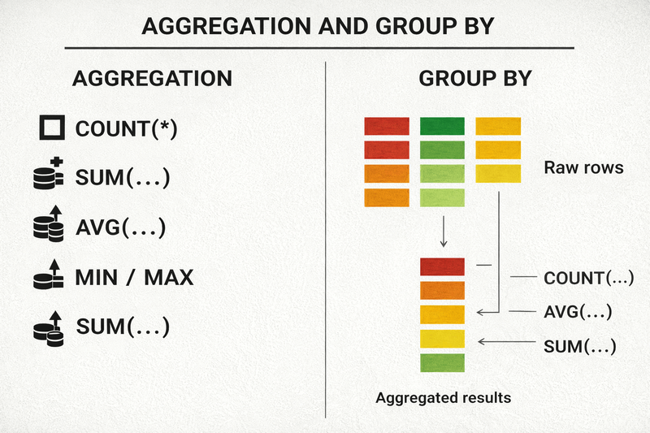
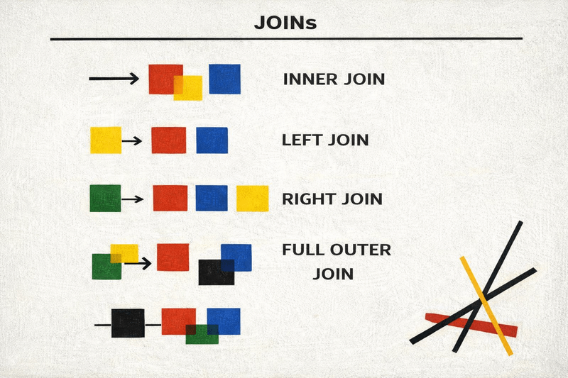
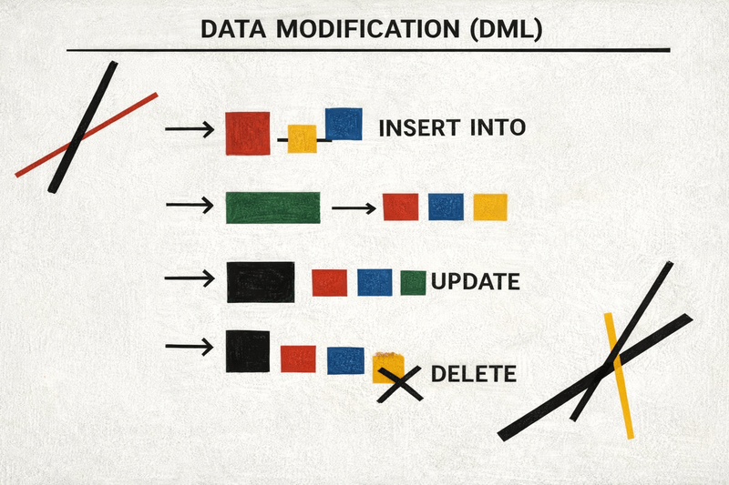
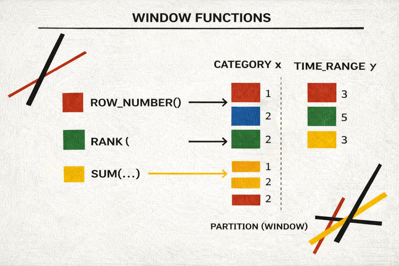

SQL is one of the very few technologies in software engineering that
does not fade with trends.

Frameworks change every few years. Backend stacks rotate. Frontend
ecosystems reinvent themselves. But SQL stays.

That is not nostalgia. That is infrastructure.

SQL became the universal language of data. Whether a team uses
PostgreSQL, MySQL, ClickHouse, Snowflake, or something distributed and
exotic --- chances are, they still speak SQL.

Understanding SQL today is not optional for serious developers.

Backend engineers need it to avoid pushing database logic into
application code. Analysts rely on it daily. QA engineers use it to
validate system state. Product managers use it to inspect metrics
without waiting for analytics pipelines.

This article walks through SQL step by step --- from simple SELECT
queries to advanced window functions --- using practical examples and a
PostgreSQL‑friendly syntax.

------------------------------------------------------------------------

## 1. Database Anatomy: What We Actually Work With

Before writing queries, it helps to understand what the database really is.

A relational database is simply structured tables connected by rules. Think of it as Excel with strict discipline — no messy types, no broken references, no silent mistakes.

Each table contains:

- Columns (structure)
- Rows (actual data)

The power comes from constraints and relationships.

Unlike spreadsheets, relational databases enforce:

. Strong typing
. Explicit relationships

### Primary Keys and Foreign Keys

Primary Key (PK) --- unique row identifier.

Foreign Key (FK) --- reference to another table's primary key.

Example:

- `users(id, name)`
- `orders(id, user_id, total)`

`orders.user_id` references `users.id`.

This guarantees consistency: the database will reject an order for a
non‑existent user.

### Common Data Types

Most projects rely on a core set:

- INT / BIGINT --- numeric identifiers and counters
- TEXT / VARCHAR --- strings
- TIMESTAMPTZ --- date-time stored in UTC
- JSONB (PostgreSQL) --- flexible semi‑structured data

Always store timestamps in UTC. Convert on the client side.

------------------------------------------------------------------------

## 2. Reading Data: SELECT

The most common SQL operation is reading.

Basic query:

``` sql
SELECT name, price
FROM products;
```

Avoid:

``` sql
SELECT *
FROM products;
```

Why? Because production systems scale. Fetching unnecessary columns wastes bandwidth, memory, and sometimes performance advantages from indexes.

### Aliases

``` sql
SELECT
  name AS product_name,
  price AS product_price
FROM products;
```

This is especially helpful in complex JOIN queries.

### DISTINCT

Use DISTINCT when you care about unique values, not raw rows.

``` sql
SELECT DISTINCT category
FROM products;
```

### Pagination

``` sql
SELECT id, name
FROM products
ORDER BY id
LIMIT 10 OFFSET 20;
```

Large OFFSET values are inefficient. Prefer keyset pagination in
high‑load systems:

``` sql
SELECT id, name
FROM products
WHERE id > 1000
ORDER BY id
LIMIT 10;
```

OFFSET works for small pages. For large datasets, keyset pagination is more efficient.

------------------------------------------------------------------------

## 3. Filtering and Sorting

Filtering uses WHERE.

Filtering narrows data down to what actually matters.

Instead of loading everything and filtering in application code, push logic into the database — it is optimized for this.

``` sql
SELECT name, price
FROM products
WHERE category = 'phones'
  AND price > 50000;
```

### IN

Cleaner than multiple OR statements.

``` sql
WHERE category IN ('phones', 'laptops')
```

### BETWEEN

Readable range filter.

``` sql
WHERE price BETWEEN 30000 AND 60000
```

### LIKE / ILIKE

Pattern matching for text.

``` sql
WHERE name LIKE 'iPhone%'
```

Postgres case-insensitive:

``` sql
WHERE name ILIKE 'iphone%'
```

### NULL Handling

NULL means “unknown”, not empty.

Incorrect:

``` sql
WHERE description = NULL
```

Correct:

``` sql
WHERE description IS NULL
```

### ORDER BY

Sorting is expensive on large datasets — especially without indexes.

``` sql
SELECT name, price
FROM products
ORDER BY price DESC, name ASC;
```

Sorting large datasets without indexes is expensive.

------------------------------------------------------------------------

## 4. Aggregation and GROUP BY

Aggregation turns raw data into insight.

Instead of looking at thousands of rows, we compute metrics.



Aggregate functions:

- COUNT
- SUM
- AVG
- MIN
- MAX

Example:

``` sql
SELECT
  MAX(price) AS max_price,
  AVG(price) AS avg_price,
  COUNT(*) AS total_products
FROM products;
```

### GROUP BY

Grouping splits rows into logical buckets before aggregation.

``` sql
SELECT
  category,
  COUNT(*) AS product_count,
  AVG(price) AS avg_price
FROM products
GROUP BY category;
```

Rule:

Every non-aggregated column in SELECT must appear in GROUP BY.

### HAVING

HAVING filters groups after aggregation — unlike WHERE.

Incorrect:

``` sql
SELECT category, COUNT(*)
FROM products
WHERE COUNT(*) > 10
GROUP BY category;
```

Correct:

``` sql
SELECT category, COUNT(*)
FROM products
GROUP BY category
HAVING COUNT(*) > 10;
```

------------------------------------------------------------------------

## 5. JOINs

Real SQL begins with JOINs.



JOINs connect tables. This is where relational databases shine.

Instead of duplicating data, we combine normalized structures dynamically.

### INNER JOIN

``` sql
SELECT u.name, o.total
FROM users u
JOIN orders o ON u.id = o.user_id;
```

Only matching rows are returned.

### LEFT JOIN

``` sql
SELECT u.name, o.total
FROM users u
LEFT JOIN orders o ON u.id = o.user_id;
```

All users appear. Missing matches become NULL.

Find users without orders:

``` sql
SELECT u.name
FROM users u
LEFT JOIN orders o ON u.id = o.user_id
WHERE o.id IS NULL;
```

### SELF JOIN

Used when a table references itself (hierarchies, managers, categories).

``` sql
SELECT e.name AS employee,
       m.name AS manager
FROM employees e
LEFT JOIN employees m ON e.manager_id = m.id;
```

------------------------------------------------------------------------

## 6. Data Modification (DML)

These queries change actual data.

Use carefully.



### INSERT

``` sql
INSERT INTO users (name, email)
VALUES ('Alex', 'alex@example.com');
```

Always list columns.

### UPDATE

``` sql
UPDATE products
SET price = 65000
WHERE id = 42;
```

Never run UPDATE without WHERE unless intentional.

### DELETE

``` sql
DELETE FROM users
WHERE last_login < '2020-01-01';
```

### TRUNCATE

``` sql
TRUNCATE TABLE logs;
```

Instantly removes all rows.

------------------------------------------------------------------------

## 7. Schema Changes (DDL)

DDL modifies structure, not data.

Think of it as plumbing — not water.

### CREATE TABLE

Defines structure and constraints.

``` sql
CREATE TABLE orders (
  id BIGSERIAL PRIMARY KEY,
  user_id BIGINT NOT NULL,
  total NUMERIC(10,2) DEFAULT 0,
  created_at TIMESTAMPTZ DEFAULT NOW()
);
```

### ALTER TABLE

Adds or modifies columns safely.

``` sql
ALTER TABLE orders
ADD COLUMN promo_code TEXT;
```

### DROP TABLE

``` sql
DROP TABLE orders;
```

Removes table permanently.

DDL is powerful and dangerous — migrations exist for a reason. Use with extreme caution!

------------------------------------------------------------------------

## 8. Subqueries and CTE

When logic becomes complex, structure matters.

### Subquery

Subqueries embed logic inline.

``` sql
SELECT name, salary
FROM employees
WHERE salary > (
  SELECT AVG(salary) FROM employees
);
```

### CTE

CTEs (WITH) make queries readable and modular. They allow you to break large queries into understandable blocks.

``` sql
WITH top_customers AS (
  SELECT user_id, SUM(total) AS spent
  FROM orders
  GROUP BY user_id
  HAVING SUM(total) > 100000
)
SELECT *
FROM top_customers;
```

CTEs improve readability.

------------------------------------------------------------------------

## 9. Window Functions

Window functions compute aggregates without collapsing rows.



Example: top 3 salaries per department.

``` sql
WITH ranked AS (
  SELECT
    department,
    name,
    salary,
    RANK() OVER (
      PARTITION BY department
      ORDER BY salary DESC
    ) AS dept_rank
  FROM employees
)
SELECT *
FROM ranked
WHERE dept_rank <= 3;
```

Window functions enable:

- Ranking
- Running totals
- Moving averages
- Row comparisons (LAG / LEAD)

Once mastered, window functions replace large portions of application-side logic.

------------------------------------------------------------------------

## 10. Logical Execution Order

SQL executes in this order:

. FROM / JOIN
. WHERE
. GROUP BY
. HAVING
. SELECT
. ORDER BY
. LIMIT

Understanding this prevents common mistakes.

------------------------------------------------------------------------

## 11. Indexes and Performance

Indexes allow fast lookups.

Example:

``` sql
SELECT id, status
FROM users
WHERE status = 'VIP';
```

If index covers these columns, database can avoid reading full rows.

But:

``` sql
SELECT *
FROM users
WHERE status = 'VIP';
```

Forces table fetches.

Always select only required columns.

------------------------------------------------------------------------

## Conclusion

SQL is easy to start and difficult to master.

Core recommendations:

- Avoid SELECT \*
- Use LEFT JOIN intentionally
- Understand NULL
- Learn window functions early
- Know execution order

Frameworks change. Data remains.

Invest in SQL.

## Related articles

- [Top 10 CSS Tips to Master in 2024](/10-css-tips/)
- [10 Must-Know Custom React Hooks for Your Projects](/10-custom-react-hooks/)
- [10 Free AI Tools You Can Use Without Registration](/10-free-ai-2025/)
