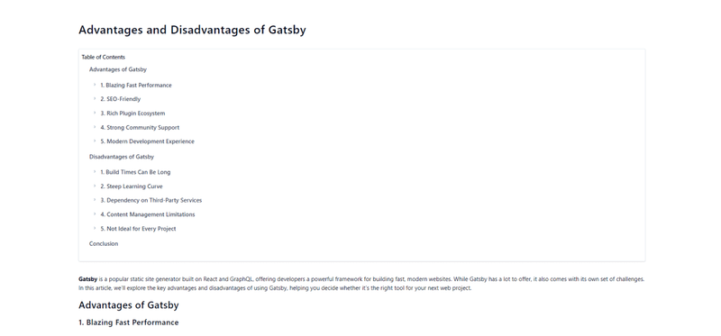

Creating a table of contents **(TOC)** is a common feature in content-heavy websites like blogs,
documentation, and eBooks. In a Gatsby project, implementing a modern TOC component that is
efficient, user-friendly, and doesn’t rely on DOM fetching or extra plugins can greatly enhance your
site’s usability. This article will guide you through building a **TOC** in **Gatsby** that
dynamically generates links to headings within a page, all while maintaining optimal performance.

## Why Avoid DOM Fetching and Extra Plugins?

Before diving into the implementation, let's briefly discuss why it's beneficial to avoid DOM
fetching and additional plugins when creating a TOC:

1. **Performance**: Direct DOM manipulation can be costly in terms of performance, especially in
   large pages with many elements. It’s better to work with the data you already have at build time.

2. **SEO**: Relying on JavaScript to fetch and manipulate the DOM can delay content rendering, which
   might negatively impact SEO. A server-rendered TOC is available immediately to search engines.

3. **Simplicity**: By avoiding extra plugins, you keep your project dependencies minimal, reducing
   the potential for conflicts and making the code easier to maintain.

### Overview of the Approach

Our approach will leverage Gatsby’s powerful **GraphQL** data layer to fetch headings from markdown
or **MDX** files at build time. We will then use this data to generate the TOC without the need to
parse the DOM dynamically. The end result is a static, SEO-friendly **TOC** that can be styled and
customized to match your site’s design.

## Setting Up the Gatsby Project

**Prerequisites**

- **Gatsby**: Make sure you have a Gatsby project set up. If not, you can quickly create one using
  the **Gatsby CLI**.
- **Markdown or MDX Content**: This guide assumes that your content is written in Markdown or MDX,
  which is typical for blogs or documentation sites built with Gatsby.

If you don't already have a Gatsby project, you can create one by running the following command in
your terminal:

<span className='code-block'>gatsby new</span>

```js
What would you like to call your site?
√ · gatsby-toc
What would you like to name the folder where your site will be created?
√ Gatsby/ gatsby-toc
√ Will you be using JavaScript or TypeScript?
· TypeScript
√ Will you be using a CMS?
· No (or I\'ll add it later)
√ Would you like to install a styling system?
· Tailwind CSS
√ Would you like to install additional features with other plugins?
· Add responsive images
· Generate a manifest file
```

<span className='code-block'>cd gatsby-toc</span>

**Edit tsconfig.json file**

```json
{
  "compilerOptions": {
    // ...
    "baseUrl": ".",
    "paths": {
      "@/*": ["./src/*"]
    }
    // ...
  }
}
```

**Create gatsby-node.ts file**

```ts
import * as path from 'path';

import * as path from 'path';

export const onCreateWebpackConfig = ({ actions }) => {
  actions.setWebpackConfig({
    resolve: {
      alias: {
        '@/components': path.resolve(__dirname, 'src/components'),
        '@/lib/utils': path.resolve(__dirname, 'src/lib/utils'),
      },
    },
  });
};
```

**Run the CLI**

<span className='code-cmd'>npx shadcn@latest init</span>

```bash
Would you like to use TypeScript (recommended)? no / yes
Which style would you like to use? › Default
Which color would you like to use as base color? › Slate
Where is your global CSS file? › › ./src/styles/globals.css
Do you want to use CSS variables for colors? › no / yes
Where is your tailwind.config.js located? › tailwind.config.js
Configure the import alias for components: › @/components
Configure the import alias for utils: › @/lib/utils
Are you using React Server Components? › no
```

**Add this code to your tailwind.config.js file:**

```js
	content: [
		`./src/pages/**/*.{js,jsx,ts,tsx}`,
		`./src/components/**/*.{js,jsx,ts,tsx}`,
		`./src/templates/**/*.{js,jsx,ts,tsx}`,
	],
```

Next, ensure you have the necessary plugins for working with Markdown or MDX:

<span className='code-cmd'>
  npm install gatsby-source-filesystem gatsby-plugin-mdx
  rehype-autolink-headings
</span>

In your **gatsby-config.ts**, configure the plugins to source content from your markdown or MDX
files:

```js
import type { GatsbyConfig } from 'gatsby';

const config: GatsbyConfig = {
  siteMetadata: {
    title: `Table of Contents Blog`,
    siteUrl: `https://www.yourdomain.tld`,
    twitterUsername: '@some',
    image: './src/images/icon.png',
    description: `Table of Contents Blog. `,
  },
  graphqlTypegen: true,
  plugins: [
    'gatsby-plugin-postcss',
    'gatsby-plugin-image',
    {
      resolve: 'gatsby-plugin-manifest',
      options: {
        icon: 'src/images/icon.png',
      },
    },
    'gatsby-plugin-sharp',
    'gatsby-transformer-sharp',
    {
      resolve: 'gatsby-source-filesystem',
      options: {
        name: 'images',
        path: './src/images/',
      },
      __key: 'images',
    },
    {
      resolve: 'gatsby-source-filesystem',
      options: {
        name: 'pages',
        path: './src/pages/',
      },
      __key: 'pages',
    },
    {
      resolve: `gatsby-source-filesystem`,
      options: {
        name: 'content',
        path: `./content/`,
      },
    },
    {
      resolve: 'gatsby-plugin-mdx',
      options: {
        extensions: ['.md', '.mdx'],
        mdxOptions: {
          rehypePlugins: [
            {
              resolve: `rehype-autolink-headings`,
              options: { behavior: `wrap` },
            },
          ],
        },
      },
    },
  ],
};

export default config;
```

## Prepare some MDX content

Create a **content** directory at the root of your project and add some markdown or MDX files to
test with.

Create a file **gatsby-pros-cons/post.mdx** inside the **content** directory. Fill the file:

```mdx
---
title: Advantages and Disadvantages of Gatsby
slug: gatsby-pros-cons
permalink: gatsby-pros-cons
date: 2024-09-02
author: gatsby john
category: gatsby
type: post
tags: ['gatsby', 'react']
desc:
  Discover the best practices for implementing the Singleton Design Pattern in JavaScript and
  TypeScript. This guide covers step-by-step instructions to ensure efficient and scalable code.
---

**Gatsby** is a popular static site generator built on React and GraphQL, offering developers a
powerful framework for building fast, modern websites. While Gatsby has a lot to offer, it also
comes with its own set of challenges. In this article, we’ll explore the key advantages and
disadvantages of using Gatsby, helping you decide whether it’s the right tool for your next web
project.

## Advantages of Gatsby

### 1. Blazing Fast Performance

One of Gatsby's biggest selling points is its incredible speed. Gatsby pre-renders pages into static
HTML at build time, resulting in fast load times. This is particularly beneficial for user
experience and SEO, as fast-loading sites are favored by search engines and users alike.

- **Optimized Asset Handling**: Gatsby automatically optimizes images, JavaScript, and CSS, ensuring
  that your site loads as quickly as possible. It lazy-loads images and uses techniques like code
  splitting and prefetching to further enhance performance.
- **Progressive Web App (PWA) Features**: Gatsby comes with built-in PWA features, including service
  workers and offline support, which help deliver a seamless user experience even in poor network
  conditions.

### 2. SEO-Friendly

Gatsby is designed with SEO in mind. Since Gatsby generates static HTML pages at build time, these
pages are fully crawlable by search engines, improving your site’s visibility. Additionally, Gatsby
makes it easy to manage metadata, URLs, and other SEO-related elements.

- **Structured Data**: With Gatsby, you can easily implement structured data to enhance how your
  site appears in search engine results.
- **Sitemaps and RSS Feeds**: Gatsby plugins make it simple to generate sitemaps and RSS feeds,
  further boosting your site's SEO

### 3. Rich Plugin Ecosystem

Gatsby has a vast ecosystem of plugins that allow you to extend its functionality with minimal
effort. Whether you need to integrate with a CMS, optimize images, or add analytics, there’s likely
a Gatsby plugin available to help.

- **Content Integration**: Gatsby integrates seamlessly with a variety of CMS platforms, including
  WordPress, Contentful, and Sanity, allowing you to manage your content easily.
- **Data Sources**: With Gatsby’s source plugins, you can pull data from multiple sources, including
  REST APIs, GraphQL endpoints, and markdown files, and combine them into a single GraphQL schema.

### 4. Strong Community Support

Gatsby has a large and active community, which means plenty of resources are available to help you
get started or troubleshoot issues. The Gatsby documentation is comprehensive, and there are
numerous tutorials, blog posts, and courses available online.

- **Open Source**: Gatsby is an open-source project, so you benefit from the contributions of
  developers around the world who continuously improve the platform.

### 5. Modern Development Experience

Gatsby leverages modern web development tools and practices, making it a great choice for developers
who enjoy working with cutting-edge technologies.

- **React**: Since Gatsby is built on React, you can use the latest features of React, such as hooks
  and context, to build dynamic, interactive user interfaces.
- **GraphQL**: Gatsby uses GraphQL to manage data, providing a flexible and powerful way to query
  content from various sources.

## Disadvantages of Gatsby

### 1. Build Times Can Be Long

One of the downsides of Gatsby is that as your site grows in size and complexity, build times can
become significantly longer. This can be especially problematic for large e-commerce sites or
content-heavy blogs with thousands of pages.

- **Incremental Builds**: While Gatsby Cloud offers incremental builds to address this issue, this
  feature is not available in the open-source version of Gatsby.

### 2. Steep Learning Curve

Gatsby can be challenging to learn for developers who are not familiar with React or GraphQL. The
platform requires a good understanding of modern JavaScript, and getting up to speed with its
concepts and best practices can take some time.

- **Complexity**: While Gatsby’s plugin system is powerful, it can also introduce complexity,
  especially when integrating multiple plugins or troubleshooting plugin-related issues.

### 3. Dependency on Third-Party Services

Gatsby’s performance and features often rely on third-party services, such as content management
systems (CMS) and hosting platforms. This dependency can lead to challenges, such as dealing with
API rate limits, managing external service outages, or facing unexpected costs.

- **Hosting and Deployment**: While you can deploy a Gatsby site on any static hosting service, some
  advanced features (like incremental builds) require specific platforms like Gatsby Cloud, which
  may introduce additional costs.

### 4. Content Management Limitations

While Gatsby can integrate with various CMS platforms, the experience is not as seamless as using a
traditional CMS. Content editors may find it difficult to preview changes or may require a more
technical setup to manage content effectively.

**Previewing Content**: Gatsby does not natively support live previews of content edits, making it
challenging for non-technical users to see changes in real-time without additional configuration.

### 5. Not Ideal for Every Project

Gatsby is best suited for sites that don’t require frequent updates or dynamic content. If your site
involves a lot of user-generated content, real-time updates, or server-side processing, a
traditional CMS or a server-rendered framework like Next.js might be more appropriate.

- **Dynamic Content**: Handling dynamic content or features like user authentication and real-time
  updates can be complex in Gatsby, requiring workarounds or third-party services.

## Conclusion

Gatsby offers numerous advantages, particularly for developers building fast, SEO-friendly static
websites. Its modern development experience, extensive plugin ecosystem, and strong community
support make it a compelling choice for many projects. However, it’s essential to be aware of its
limitations, including potential build time issues, a steep learning curve, and challenges with
dynamic content. By weighing these advantages and disadvantages, you can determine whether Gatsby is
the right tool for your next web development project.
```

## Querying for Content and Headings with GraphQL

**Gatsby’s GraphQL** layer allows you to query for specific data from your Markdown or MDX files.
First add **createPages** function to your gatsby-node.ts file:

```ts
import * as path from 'path';
import {
  CreateNodeArgs,
  CreatePagesArgs,
  CreateWebpackConfigArgs,
  GatsbyNode,
} from 'gatsby';

import * as path from 'path';
import {
  CreateNodeArgs,
  CreatePagesArgs,
  CreateWebpackConfigArgs,
  GatsbyNode,
} from 'gatsby';

export const onCreateWebpackConfig: GatsbyNode[`onCreateWebpackConfig`] = ({
  actions,
}: CreateWebpackConfigArgs) => {
  actions.setWebpackConfig({
    resolve: {
      alias: {
        '@/components': path.resolve(__dirname, 'src/components'),
        '@/lib/utils': path.resolve(__dirname, 'src/lib/utils'),
      },
    },
  });
};

export const createPages: GatsbyNode[`createPages`] = async ({
  graphql,
  actions,
  reporter,
}: CreatePagesArgs) => {
  const { createPage } = actions;
  const postTemplate = path.resolve(`src/templates/post-template.tsx`);

  const result = await graphql<Queries.GatsbyNodeCreatePagesQuery>(`
    query GatsbyNodeCreatePages {
      allMdx {
        nodes {
          frontmatter {
            slug
          }
          internal {
            contentFilePath
          }
        }
      }
    }
  `);

  if (result.errors) {
    reporter.panicOnBuild('Error loading MDX result', result.errors);
  }

  const posts = result.data.allMdx.nodes;
  console.log('posts', posts);

  posts.forEach(node => {
    console.log(node);
    createPage({
      path: `/${node.frontmatter.slug}`,
      component: `${postTemplate}?__contentFilePath=${node.internal.contentFilePath}`,
      context: {
        slug: node.frontmatter.slug,
      },
    });
  });
};
```

### 1. Create use-site-metadata hook

Create file **hooks/use-site-metadata.tsx** inside the src directory.

```tsx
import { graphql, useStaticQuery } from 'gatsby';

import { graphql, useStaticQuery } from 'gatsby';

type SiteMetadata = {
  title: string;
  description: string;
  twitterUsername: string;
  image: string;
  siteUrl: string;
};

type graphqlResult = {
  site: {
    siteMetadata: SiteMetadata;
  };
};

export const useSiteMetadata = (): SiteMetadata => {
  const data: graphqlResult = useStaticQuery(graphql`
    {
      site {
        siteMetadata {
          title
          description
          twitterUsername
          image
          siteUrl
        }
      }
    }
  `);

  return data.site.siteMetadata;
};
```

### 2. Create SEO component

Create file **seo.tsx**

```ts
import * as React from 'react';
import { useLocation } from '@reach/router';

import { useSiteMetadata } from '../hooks/use-site-metadata';

interface SeoProps {
  title?: string;
  description?: string;
  lang?: string;
  image?: string;
  article?: boolean;
  canonicalUrl?: string;
  nonCanonical?: boolean;
  author?: string;
  noindex?: boolean;
}

const SEO: React.FC<React.PropsWithChildren<SeoProps>> = ({
  title: propTitle,
  description: propDescription,
  lang: propLang,
  image,
  article,
  canonicalUrl: propCanonicalPath,
  nonCanonical = false,
  author: propAuthor,
  noindex = false,
  children,
}) => {
  const {
    title: siteTitle,
    description: siteDescription,
    image: siteImage,
    siteUrl,
    twitterUsername,
  } = useSiteMetadata();

  // By default, we will construct the canonical path ourselves, but this can
  // be overwritten via the component properties
  const { pathname } = useLocation();
  const defaultCanonicalPath = `${siteUrl}/${pathname}`;
  const canonicalUrl = propCanonicalPath || defaultCanonicalPath;

  const siteName = siteTitle || 'JavaScript Development Blog';
  const title = propTitle;
  const description = propDescription || siteDescription || '';
  const lang = propLang || 'en_US';

  return (
    <>
      <title>{title}</title>
      {!nonCanonical && <link rel='canonical' href={canonicalUrl} />}
      <meta name='description' content={description} />
      <meta property='og:title' content={title} />
      <meta property='og:description' content={description} />
      <meta property='og:type' content={article ? 'article' : 'website'} />
      <meta property='og:url' content={canonicalUrl} />
      <meta property='og:site_name' content={siteName} />
      <meta property='og:locale' content={lang} />
      <meta name='twitter:creator' content={twitterUsername} />
      <meta name='twitter:site' content={twitterUsername} />
      <meta name='tiwtter:url' content={canonicalUrl} />
      <meta name='twitter:title' content={title} />
      <meta name='twitter:description' content={description} />
      {image ? (
        <>
          <meta property='og:image' content={`${siteUrl}/${image}`} />
          <meta name='twitter:card' content='summary_large_image' />
        </>
      ) : (
        <>
          <meta property='og:image' content={`${siteUrl}/${siteImage}`} />
          <meta name='twitter:card' content='summary' />
        </>
      )}
      {noindex && <meta name='googlebot' content='noindex, nofollow' />}
      {children}
    </>
  );
};

export default SEO;
```

### 3. Add slugify function

Add a function to **/lib/utils.ts** file:

```ts
export const slugify = (text: string): string => {
  return text
    .toString()
    .toLowerCase()
    .replace(/\s+/g, '-') // Replace spaces with -
    .replace(/[^\w-]+/g, '') // Remove all non-word chars
    .replace(/--+/g, '-') // Replace multiple - with single -
    .replace(/^-+/, '') // Trim - from start of text
    .replace(/-+$/, ''); // Trim - from end of text
};
```

## Creating the Table of Contents Component

Now, let’s create a Table Of Contents component that will render the TOC data as a nested list of
links.

### 1. Install the shadcn card component

<span className='code-cmd'>npx shadcn@latest add card</span>

### 2. Create a TOC Component

Create a new file at **src/components/tos/table-of-contents.tsx**:

```ts
import * as React from 'react';
import { Card, CardContent, CardTitle } from '../ui/card';

type TableOfContentsItem = {
  url: string;
  title: string;
  items?: TableOfContentsItem[];
};

type TableOfContentsProps = {
  items: TableOfContentsItem[];
};

const TableOfContents = ({ items }: TableOfContentsProps) => {
  return (
    <Card className='my-10 rounded p-2 pb-0 dark:bg-gray-800'>
      <CardTitle className='text-slate-900 font-semibold mb-4 dark:text-slate-100 pt-2'>
        Table of Contents
      </CardTitle>
      <CardContent>
        <ul className='text-slate-700 pb-0'>
          {items.map((item) => {
            return (
              <div key={`${item.title}`}>
                <li className='my-4'>
                  <a
                    href={`${item.url}`}
                    className='py-1 font-medium hover:text-slate-900 dark:text-slate-300 dark:hover:text-slate-200'
                  >
                    {item.title}
                  </a>
                </li>
                {item.items &&
                  item.items.length &&
                  item.items.map((item) => {
                    return (
                      <span key={`${item.title}`}>
                        <li className='ml-4 my-2' key={`${item.title}`}>
                          <a
                            href={`${item.url}`}
                            className='group flex gap-2 items-start py-1 font-medium hover:text-slate-900 dark:text-slate-300 dark:hover:text-slate-200'
                          >
                            <svg
                              width='3'
                              height='24'
                              viewBox='0 -9 3 24'
                              className='mr-2 text-slate-400 overflow-visible group-hover:text-slate-600 dark:text-slate-500 dark:group-hover:text-slate-400'
                            >
                              <path
                                d='M0 0L3 3L0 6'
                                fill='none'
                                stroke='currentColor'
                                strokeWidth='1.5'
                                strokeLinecap='round'
                              ></path>
                            </svg>
                            {item.title}
                          </a>
                        </li>
                        {item.items &&
                          item.items.length &&
                          item.items.map((item) => {
                            return (
                              <li className='ml-8 my-1' key={`${item.title}`}>
                                <a
                                  href={`${item.url}`}
                                  className='group flex gap-2 items-start py-1 font-medium hover:text-slate-900 dark:text-slate-300 dark:hover:text-slate-200'
                                >
                                  <svg
                                    width='3'
                                    height='24'
                                    viewBox='0 -9 3 24'
                                    className='mr-2 text-slate-400 overflow-visible group-hover:text-slate-600 dark:text-slate-500 dark:group-hover:text-slate-400'
                                  >
                                    <path
                                      d='M0 0L3 3L0 6'
                                      fill='none'
                                      stroke='currentColor'
                                      strokeWidth='1.5'
                                      strokeLinecap='round'
                                    ></path>
                                  </svg>
                                  {item.title}
                                </a>
                              </li>
                            );
                          })}
                      </span>
                    );
                  })}
              </div>
            );
          })}
        </ul>
      </CardContent>
    </Card>
  );
};
export default TableOfContents;
```

## Integrating the TOC into Your Pages

Create file **post-template.tsx** and **templates** directory inside the **src** folder:

```ts
import * as React from 'react';
import { graphql, HeadFC, PageProps } from 'gatsby';
import { MDXProvider } from '@mdx-js/react';

import TableOfContents from '../components/tos/table-of-contents';
import SEO from '../components/seo';
import { slugify } from '../lib/utils';

const MdxComponents = {
  h2: ({ children }: HeadingProps) => {
    const id = slugify(children);
    return (
      <h2 className={`my-5 font-ptSerif font-medium leading-9 tracking-wide text-3xl`} id={`${id}`}>
        {children}
      </h2>
    );
  },
  h3: ({ children }: HeadingProps) => {
    const id = slugify(children);
    return (
      <h3 className={`my-5 font-ptSerif font-medium tracking-wide text-2xl`} id={`${id}`}>
        {children}
      </h3>
    );
  },
  h4: ({ children }: HeadingProps) => {
    const id = slugify(children);
    return (
      <h4 className={`my-5 font-ptSerif tracking-wide text-xl`} id={`${id}`}>
        {children}
      </h4>
    );
  },
};

const PostTemplate: React.FC<PageProps<Queries.GetSinglePostQuery>> = ({
  data: {
    mdx: {
      frontmatter: { title },
      tableOfContents,
    },
  },
  children,
}) => {
  return (
    <div className='my-16 px-64'>
      <article className='text-lg'>
        <h1 className='tracking-wide text-4xl font-medium space-y-5 my-5'>{title}</h1>
        <TableOfContents items={tableOfContents.items} />
        <MDXProvider components={MdxComponents}> {children}</MDXProvider>
      </article>
    </div>
  );
};
export const query = graphql`
  query GetSinglePost($slug: String) {
    mdx(frontmatter: { slug: { eq: $slug } }) {
      excerpt
      frontmatter {
        title
      }
      tableOfContents
    }
  }
`;

export const Head: HeadFC<Queries.GetSinglePost, unknown> = ({
  data: {
    mdx: {
      excerpt: description,
      frontmatter: { title },
    },
  },
}) => {
  return (
    <>
      <SEO title={title} description={description} />
    </>
  );
};

export default PostTemplate;
```

Now run:

<span className='code-cmd'>npm run develop</span>

<div className='single-post__img-wrapper'>
  
  <span className='single-post__img-alt'>Table of Contents in Gatsby</span>
</div>

Get the full code below on [github](https://github.com/jsdevspace/toc-gatsby/tree/main)

## Conclusion

By following this guide, you've learned how to build a modern **Table of Contents component in
Gatsby** without relying on DOM fetching or additional plugins. This approach leverages Gatsby's
GraphQL data layer to generate a TOC at build time, ensuring your site remains fast, SEO-friendly,
and easy to maintain. You can now easily customize and expand upon this TOC component to fit the
unique needs of your Gatsby site.
