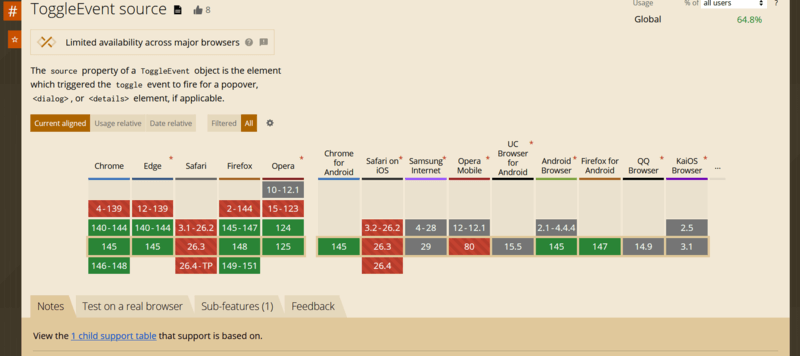
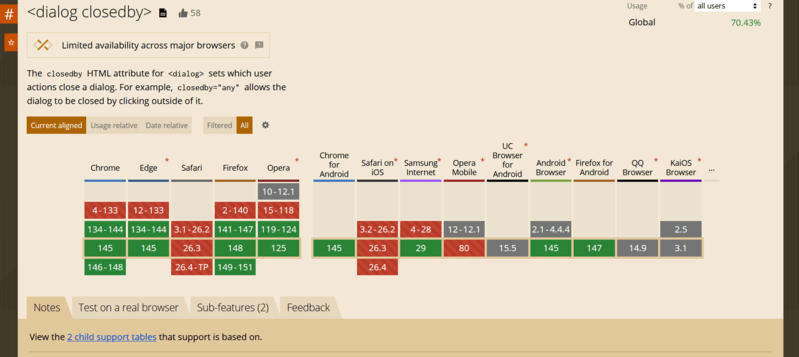

The modern web platform continues evolving with small but powerful
improvements. Two recent additions --- [**`ToggleEvent.source`**](https://developer.mozilla.org/en-US/docs/Web/API/ToggleEvent/source) and the
[**`closedby` attribute for `<dialog>`**](https://developer.mozilla.org/en-US/docs/Web/HTML/Reference/Elements/dialog#closedby) --- make working with dialogs
and popovers significantly easier.

`ToggleEvent.source` allows developers to determine **which element
triggered a popover or dialog visibility change**, while `closedby`
allows you to **declare how a dialog can be closed** without writing
extra JavaScript.

These additions move the web platform further toward **declarative UI
behavior**.

------------------------------------------------------------------------

## ToggleEvent.source

The **`source` property** of the [`ToggleEvent`](https://developer.mozilla.org/en-US/docs/Web/API/ToggleEvent) interface is a
**read‑only reference to the element that triggered the toggle event**.

In simple terms, it tells you:

> Which element opened or closed a popover or dialog.

The property returns an instance of [**`Element`**](https://developer.mozilla.org/en-US/docs/Web/API/Element).

If the visibility change was triggered **programmatically**, the value
will be **`null`**.

### Browser support

Most modern browsers [already support](https://caniuse.com/wf-toggleevent-source) the property. Safari currently
exposes it behind an experimental flag.



### Elements that can trigger popovers

A popover can be triggered by:

-   `<button commandfor="...">` [commandfor attribute](https://developer.mozilla.org/en-US/docs/Web/HTML/Reference/Elements/button#commandfor)
-   `<button popovertarget="...">` [popovertarget attribute](https://developer.mozilla.org/en-US/docs/Web/HTML/Reference/Elements/button#popovertarget)
-   `<input type="button" popovertarget="...">` 

### Elements that can behave as popovers

-   `<dialog>`
-   Any element with the [`popover`](https://developer.mozilla.org/en-US/docs/Web/HTML/Reference/Global_attributes/popover) attribute

------------------------------------------------------------------------

## Example

Consider a dialog with multiple buttons that close it.

We want to determine **which button closed the dialog** and display the
result.

``` html
<div>
  <button commandfor="my-dialog" command="show-modal">
    Show modal dialog
  </button>

  <dialog id="my-dialog">
    <h3>Do you like modern Web APIs?</h3>

    <div style="display:flex; gap:10px">
      <button commandfor="my-dialog" command="close" data-answer="yes">
        Yes
      </button>

      <button commandfor="my-dialog" command="close" data-answer="sure">
        Sure
      </button>
    </div>
  </dialog>

  <p>No answer yet</p>
</div>
```

Now we listen for the `toggle` event.

``` javascript
const paragraph = document.querySelector("p");

document.querySelector("dialog").addEventListener("toggle", (event) => {

  if (!(event.source instanceof HTMLButtonElement)) return;

  const { answer } = event.source.dataset;

  if (answer) {
    paragraph.textContent = `Answer: ${answer}`;
  }

});
```

With `ToggleEvent.source`, determining the trigger element becomes
trivial.

<Codepen id="019cbfd7-7afe-776d-afbe-461c3c60fb50" />
------------------------------------------------------------------------

## HTMLDialogElement.closedBy

The [**`closedby` attribute**](https://developer.mozilla.org/en-US/docs/Web/API/HTMLDialogElement/closedBy) defines **which user actions are allowed to
close a dialog**.

Previously, developers often needed custom JavaScript logic to control
this behavior. Now it can be defined directly in HTML.

This attribute is supported by all major browsers (Safari currently ships it behind an experimental flag).



### Supported closing actions

Dialogs can be closed by:

1.  Clicking outside the dialog on the overlay (light dismiss).
2.  Platform actions such as pressing **Esc**.
3.  A developer-defined action such as a button calling
    [`dialog.close()`](https://developer.mozilla.org/en-US/docs/Web/API/HTMLDialogElement/close).

------------------------------------------------------------------------

## Attribute values

### any

The dialog can be closed using **all methods** above.

### closerequest

The dialog can be closed by:

-   pressing **Esc**
-   developer-defined logic

### none

The dialog can only be closed **programmatically or by explicit UI
controls**.

------------------------------------------------------------------------

## Default behavior

The default value depends on how the dialog is opened.

If opened using: [`showModal()`](https://developer.mozilla.org/en-US/docs/Web/API/HTMLDialogElement/showModal), the default becomes: `closerequest`.

Otherwise the default is: `none`

### Why this matters

Before `closedby`, implementing overlay click closing required JavaScript logic, such as custom hooks ([`useClickOutside`](https://jsdev.space/10-custom-react-hooks/) in React).

Now this behavior can be defined purely declaratively.

------------------------------------------------------------------------

## Example with multiple dialogs

``` html
<div class="demo">
  <button class="open" commandfor="dlg-any" command="show-modal">
    Open dialog (closedby="any")
  </button>

  <!-- 1) closedby="any" -->
  <dialog id="dlg-any" closedby="any">
    <div class="dialog">
      <header class="header">
        <h3>Dialog A — closedby="any"</h3>
        <button class="icon" commandfor="dlg-any" command="close" aria-label="Close">
          ✖
        </button>
      </header>

      <p>
        This dialog can be closed by clicking the backdrop, pressing Esc, or using a Close button.
      </p>

      <footer class="footer">
        <button class="cancel" commandfor="dlg-any" command="close">Close</button>

        <button class="confirm" commandfor="dlg-closerequest" command="show-modal">
          Open dialog B
        </button>
      </footer>
    </div>
  </dialog>

  <!-- 2) closedby="closerequest" -->
  <dialog id="dlg-closerequest" closedby="closerequest">
    <div class="dialog">
      <header class="header">
        <h3>Dialog B — closedby="closerequest"</h3>
        <button class="icon" commandfor="dlg-closerequest" command="close" aria-label="Close">
          ✖
        </button>
      </header>

      <p>
        This dialog closes via Esc or explicit controls. Clicking the backdrop should NOT close it.
      </p>

      <footer class="footer">
        <button class="cancel" commandfor="dlg-closerequest" command="close">Close</button>

        <button class="confirm" commandfor="dlg-none" command="show-modal">
          Open dialog C
        </button>
      </footer>
    </div>
  </dialog>

  <!-- 3) closedby="none" -->
  <dialog id="dlg-none" closedby="none">
    <div class="dialog">
      <header class="header">
        <h3>Dialog C — closedby="none"</h3>
        <button class="icon" commandfor="dlg-none" command="close" aria-label="Close">
          ✖
        </button>
      </header>

      <p>
        This dialog can ONLY be closed by explicit controls (your buttons / JS). Esc and backdrop
        clicks should NOT close it.
      </p>

      <footer class="footer">
        <button class="cancel" commandfor="dlg-none" command="close">Close</button>
      </footer>
    </div>
  </dialog>
</div>
```

------------------------------------------------------------------------

## Styling dialogs

Basic styles might look like this:

``` css
:root {
  --p: 6px;
}

.demo {
  font-family: system-ui, sans-serif;
  display: grid;
  place-items: center;
  min-height: 50vh;
  gap: calc(var(--p) * 4);
}

button {
  padding: calc(var(--p) * 2) calc(var(--p) * 4);
  border: 0;
  border-radius: calc(var(--p) * 2);
  cursor: pointer;
}

button:focus-visible {
  outline: 2px solid #000;
  outline-offset: 2px;
}

button.open {
  background: #0d6efd;
  color: #fff;
}

dialog {
  padding: 0;
  border: 0;
  background: transparent;
}

dialog::backdrop {
  background: rgba(0, 0, 0, 0.15);
}

.dialog {
  background: #fff;
  min-width: 320px;
  max-width: 520px;
  border-radius: calc(var(--p) * 2);
  padding: calc(var(--p) * 4);
  box-shadow: 0 6px 18px rgba(0, 0, 0, 0.15);
  display: grid;
  gap: calc(var(--p) * 3);
}

.header {
  display: flex;
  align-items: center;
  justify-content: space-between;
  gap: calc(var(--p) * 2);
}

.header h3 {
  margin: 0;
  font-size: 1.1rem;
}

button.icon {
  padding: var(--p) calc(var(--p) * 2);
  background: transparent;
  font-size: 1rem;
}

.footer {
  display: flex;
  justify-content: flex-end;
  gap: calc(var(--p) * 2);
}

button.cancel {
  background: #dc3545;
  color: #fff;
}

button.confirm {
  background: #198754;
  color: #fff;
}
```

<Codepen id="019cbfe6-3af9-7df2-bdc7-e346d90ddb88" />

------------------------------------------------------------------------

## The stacked overlay problem

If multiple dialogs are opened, their backdrops stack visually. Because
each backdrop is semi‑transparent, the page becomes darker with every
dialog.

Ideally we would only display **the backdrop of the top dialog**.

Unfortunately, CSS currently has no selector that targets **the top
dialog in the browser's dialog stack**.

------------------------------------------------------------------------

## Practical workaround with MutationObserver

A simple workaround is tracking open dialogs with JavaScript.

First adjust the CSS.

``` css
dialog::backdrop {
  background: transparent;
}

dialog.active::backdrop {
  background: rgba(0,0,0,0.15);
}
```

Then track dialogs:

``` javascript
let dialogs = []

const observer = new MutationObserver((mutations) => {

  mutations.forEach((mutation) => {

    if (mutation.attributeName === "open") {

      const dialog = mutation.target

      if (dialog.open) {
        dialogs.push(dialog)
      } else {
        dialogs = dialogs.filter(d => d !== dialog)
      }

      dialogs.forEach((d, i) => {

        if (i === dialogs.length - 1) {
          d.classList.add("active")
        } else {
          d.classList.remove("active")
        }

      })

    }

  })

})

document.querySelectorAll("dialog").forEach(dialog => {
  observer.observe(dialog, { attributes: true })
})
```

This ensures that **only the top dialog displays a backdrop**,
preventing visual stacking.

------------------------------------------------------------------------

## Final thoughts

`ToggleEvent.source` and `dialog.closedby` may appear small, but they
represent meaningful progress in the evolution of the Web APIs.

They simplify event handling, reduce the need for custom JavaScript, and
move UI behavior closer to **declarative HTML patterns**.

As browsers continue expanding support for popovers and dialogs, these
APIs will likely become essential tools for building modern web
interfaces.

Happy coding.
