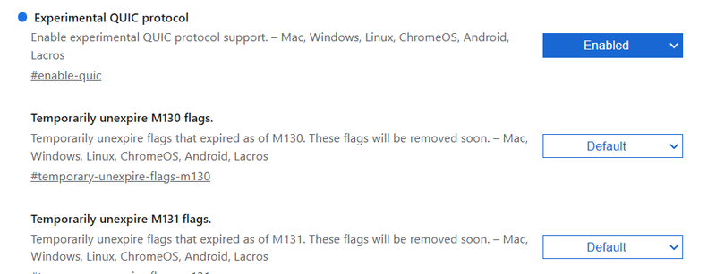

Discover the [WebTransport API](https://www.w3.org/TR/webtransport/), a revolutionary technology that enables efficient, low-latency communication between web clients and servers. Learn how this innovative protocol enhances real-time data transfer, supports bidirectional streams, and improves overall web application performance. Explore its use cases, benefits, and implementation tips to stay ahead in modern web development.

The `WebTransport API` offers a modern alternative to [WebSockets](https://developer.mozilla.org/ru/docs/Web/API/WebSockets_API), facilitating data transmission between clients and servers using the HTTP/3 Transport. It supports multiple streams, unidirectional streams, and out-of-order delivery. WebTransport enables reliable communication through streams and unreliable transport via UDP-like datagrams.

## Definition and Features

The `WebTransport API` is an interface for transmitting data between clients and servers using the [HTTP/3 protocol](https://en.wikipedia.org/wiki/HTTP/3).

It supports reliable, ordered delivery of data through one or more uni- or bidirectional streams, as well as unreliable, unordered delivery via datagrams. In the former, it serves as an alternative to WebSockets, and in the latter, it acts as an alternative to [RTCDataChannel](https://developer.mozilla.org/en-US/docs/Web/API/RTCDataChannel) provided by the [WebRTC API](https://developer.mozilla.org/ru/docs/Web/API/WebRTC_API).


As of now, neither **Node.js**, **Deno**, nor **Bun** support the `WebTransport API`.

In June 2023, WebTransport support was added to [Socket.io](https://socket.io/). However, this support relies on the package [@fails-components/webtransport](https://www.npmjs.com/package/@fails-components/webtransport), which appears more like an experimental tool not intended for production use. Despite this, let's take a closer look at this option, as Socket.io is a well-established library known for real-time data exchange.

## HTTP/3 Overview

HTTP/3 is built on Google’s [QUIC](https://en.wikipedia.org/wiki/QUIC) protocol, which itself is based on [UDP](https://en.wikipedia.org/wiki/User_Datagram_Protocol) and aims to address several limitations inherent to the [TCP](https://en.wikipedia.org/wiki/Transmission_Control_Protocol) protocol:

- **Head-of-Line (HOL) Blocking**: Unlike HTTP/2, which supports multiplexing (multiple streams transmitted over a single connection), if one stream fails in HTTP/2, others must wait for it to be restored. QUIC eliminates this issue by allowing streams to be independent.
- **Higher Performance**: QUIC outperforms TCP in various ways. One key reason is that QUIC natively implements security measures (unlike TCP, which relies on TLS), leading to fewer round trips. Additionally, QUIC streams offer a more efficient transport mechanism compared to TCP's packet-based transmission, particularly beneficial in heavily loaded networks.
- **Seamless Network Transition**: QUIC uses a unique connection identifier that allows packets to be delivered correctly across different networks. This identifier can persist across network changes, enabling uninterrupted downloads even when switching from Wi-Fi to mobile networks. In contrast, HTTP/2 relies on IP addresses, which can cause disruptions during network transitions.
- **Unreliable Delivery**: HTTP/3 supports unreliable delivery, which can be more efficient than guaranteed delivery in certain scenarios.

To enable HTTP/3 (QUIC) support in Google Chrome, go to `chrome://flags` and enable the Experimental QUIC protocol option.



## Working Principles of WebTransport API

**Establishing a Connection**

To establish an HTTP/3 connection with a server, the URL must be passed to the `WebTransport()` constructor. Note that the URL should use the HTTPS scheme, and the port must be specified explicitly. The `WebTransport.ready` promise resolves once the connection is successfully established.

The connection can be closed using the `WebTransport.closed` promise. Any errors encountered are instances of `WebTransportError`, which include additional details on top of the standard `DOMException` set.

```js
const url = 'https://example.com:4999/wt';

async function initTransport(url) {
  // Initialize the connection
  const transport = new WebTransport(url);

  // Resolving this promise indicates readiness to handle requests
  await transport.ready;

  // ...
}

async function closeTransport(transport) {
  // Handle connection closing
  try {
    await transport.closed;
    console.log(`HTTP/3 connection to ${url} closed gracefully.`);
  } catch (error) {
    console.error(`HTTP/3 connection to ${url} closed due to error: ${error}.`);
  }
}
```

This setup ensures you can effectively manage connections and handle errors when working with the WebTransport API over HTTP/3.

### Unreliable Data Transmission Using Datagrams

Unreliable transmission means that there is no guarantee of complete data delivery or the order in which it arrives. In some cases, this is acceptable, with the main advantage being faster data transfer speeds.

Unreliable data delivery is handled through the [WebTransport.datagrams](https://developer.mozilla.org/en-US/docs/Web/API/WebTransport/datagrams) property, which returns a [WebTransportDatagramDuplexStream](https://developer.mozilla.org/en-US/docs/Web/API/WebTransportDatagramDuplexStream) object containing everything necessary for sending datagrams to the server and receiving them on the client.

The [WebTransportDatagramDuplexStream.writable](https://developer.mozilla.org/en-US/docs/Web/API/WebTransportDatagramDuplexStream/writable) property provides a [WritableStream](https://developer.mozilla.org/en-US/docs/Web/API/WritableStream) object, allowing data to be sent to the server:

```js
const writer = transport.datagrams.writable.getWriter();
const data1 = new Uint8Array([65, 66, 67]);
const data2 = new Uint8Array([68, 69, 70]);
writer.write(data1);
writer.write(data2);
```

The [WebTransportDatagramDuplexStream.readable](https://developer.mozilla.org/en-US/docs/Web/API/WebTransportDatagramDuplexStream/readable) property provides a [ReadableStream](https://developer.mozilla.org/en-US/docs/Web/API/ReadableStream), allowing data received from the server to be read:

```js
async function readData() {
  const reader = transport.datagrams.readable.getReader();

  while (true) {
    const { value, done } = await reader.read();

    if (done) {
      break;
    }

    console.log(value); // value is a Uint8Array
  }
}
```

### Reliable Data Transmission Using Streams

Reliable transmission ensures complete and ordered data delivery, though it takes longer compared to datagrams. However, reliability is critical in many scenarios, such as chat applications.

When using streams for data transmission, it’s possible to define stream priorities.

### Unidirectional Data Transmission

To open a unidirectional stream, use the [WebTransport.createUnidirectionalStream()](https://developer.mozilla.org/en-US/docs/Web/API/WebTransport/createUnidirectionalStream) method, which returns a `WritableStream`. Data is sent to the server using the writer returned by `getWriter`:

```js
async function writeData() {
  const stream = await transport.createUnidirectionalStream();
  const writer = stream.writable.getWriter();
  const data1 = new Uint8Array([65, 66, 67]);
  const data2 = new Uint8Array([68, 69, 70]);
  writer.write(data1);
  writer.write(data2);

  try {
    await writer.close();
    console.log('All data has been successfully sent');
  } catch (error) {
    console.error(`An error occurred while sending data: ${error}`);
  }
}
```

The `WritableStreamDefaultWriter.close()` method is used to close the HTTP/3 connection after sending all data.

To extract data from a unidirectional stream opened on the server, use the `WebTransport.incomingUnidirectionalStreams` property, which returns `ReadableStream` objects of `WebTransportReceiveStream`.

Create a function to read from `WebTransportReceiveStream`. These objects inherit from the `ReadableStream` class, making it easy to implement:

```js
async function readData(receiveStream) {
  const reader = receiveStream.getReader();

  while (true) {
    const { done, value } = await reader.read();

    if (done) {
      break;
    }

    console.log(value); // value is a Uint8Array
  }
}
```

Get a reference to reader using `getReader()` and read from `incomingUnidirectionalStreams` in chunks (each chunk is a `WebTransportReceiveStream`):

```js
async function receiveUnidirectional() {
  const uds = transport.incomingUnidirectionalStreams;
  const reader = uds.getReader();

  while (true) {
    const { done, value } = await reader.read();

    if (done) {
      break;
    }

    await readData(value);
  }
}
```

These mechanisms allow effective handling of both reliable and unreliable data transmissions using the WebTransport API.

### Bidirectional Data Transmission

To open a bidirectional stream, use the [WebTransport.createBidirectionalStream()](https://developer.mozilla.org/en-US/docs/Web/API/WebTransport/createBidirectionalStream) method, which returns a [WebTransportBidirectionalStream](https://developer.mozilla.org/en-US/docs/Web/API/WebTransportBidirectionalStream). This stream contains readable and writable properties that provide references to instances of `WebTransportReceiveStream` and `WebTransportSendStream`. These can be used for reading data received from the server and sending data to the server, respectively.

```js
async function setUpBidirectional() {
  const stream = await transport.createBidirectionalStream();
  // stream is WebTransportBidirectionalStream
  // stream.readable is WebTransportReceiveStream
  const readable = stream.readable;
  // stream.writable is WebTransportSendStream
  const writable = stream.writable;

  // Additional setup code can follow
}
```

Reading from `WebTransportReceiveStream` can be implemented as follows:

```js
async function readData(readable) {
  const reader = readable.getReader();

  while (true) {
    const { value, done } = await reader.read();

    if (done) {
      break;
    }

    console.log(value); // value is Uint8Array
  }
}
```

Writing to `WebTransportSendStream` can be implemented as follows:

```js
async function writeData(writable) {
  const writer = writable.getWriter();
  const data1 = new Uint8Array([65, 66, 67]);
  const data2 = new Uint8Array([68, 69, 70]);
  writer.write(data1);
  writer.write(data2);
}
```

To extract data from a bidirectional stream opened on the server, use the [WebTransport.incomingBidirectionalStreams](https://developer.mozilla.org/en-US/docs/Web/API/WebTransport/incomingBidirectionalStreams) property, which returns `ReadableStream` objects of [WebTransportBidirectionalStream](https://developer.mozilla.org/en-US/docs/Web/API/WebTransportBidirectionalStream). Each stream can be used for reading and writing instances of `Uint8Array`. You’ll need a function to handle reading from the bidirectional stream:

```js
async function receiveBidirectional() {
  const bds = transport.incomingBidirectionalStreams;

  const reader = bds.getReader();

  while (true) {
    const { done, value } = await reader.read();

    if (done) {
      break;
    }

    await readData(value.readable);
    await writeData(value.writable);
  }
}
```

This approach allows the handling of bidirectional data streams efficiently, making full use of the WebTransport API.

### How to Implement WebTransport API using JS?

```js
// Create a WebTransport connection
class TransportClient {
  constructor(url) {
    this.url = url;
    this.transport = null;
    this.streams = new Map();
    this.datagramWriter = null;
    this.datagramReader = null;
  }

  async connect() {
    try {
      this.transport = new WebTransport(this.url);
      console.log('Initiating connection...');

      // Wait for connection establishment
      await this.transport.ready;
      console.log('Connection established successfully');

      // Set up error handling
      this.transport.closed
        .then(() => {
          console.log('Connection closed normally');
        })
        .catch(error => {
          console.error('Connection closed due to error:', error);
        });

      // Initialize datagram handlers
      this.setupDatagrams();
    } catch (error) {
      console.error('Failed to establish connection:', error);
      throw error;
    }
  }

  // Set up datagram sending and receiving
  setupDatagrams() {
    // Set up datagram writer
    this.datagramWriter = this.transport.datagrams.writable.getWriter();

    // Set up datagram reader
    this.handleDatagrams();
  }

  async handleDatagrams() {
    try {
      const reader = this.transport.datagrams.readable.getReader();
      while (true) {
        const { value, done } = await reader.read();
        if (done) {
          console.log('Datagram reader done');
          break;
        }
        // Process received datagram
        const decoded = new TextDecoder().decode(value);
        console.log('Received datagram:', decoded);
      }
    } catch (error) {
      console.error('Error reading datagrams:', error);
    }
  }

  // Send a datagram
  async sendDatagram(data) {
    try {
      const encoded = new TextEncoder().encode(data);
      await this.datagramWriter.write(encoded);
      console.log('Datagram sent successfully');
    } catch (error) {
      console.error('Error sending datagram:', error);
      throw error;
    }
  }

  // Create and handle a bidirectional stream
  async createBidirectionalStream() {
    try {
      const stream = await this.transport.createBidirectionalStream();
      const streamId = crypto.randomUUID();
      this.streams.set(streamId, stream);

      // Handle incoming data
      this.handleStreamInput(stream, streamId);

      return {
        streamId,
        writer: stream.writable.getWriter(),
      };
    } catch (error) {
      console.error('Error creating bidirectional stream:', error);
      throw error;
    }
  }

  async handleStreamInput(stream, streamId) {
    try {
      const reader = stream.readable.getReader();
      while (true) {
        const { value, done } = await reader.read();
        if (done) {
          console.log(`Stream ${streamId} reading complete`);
          break;
        }
        const decoded = new TextDecoder().decode(value);
        console.log(`Received on stream ${streamId}:`, decoded);
      }
    } catch (error) {
      console.error(`Error reading from stream ${streamId}:`, error);
    } finally {
      this.streams.delete(streamId);
    }
  }

  // Send data through a specific stream
  async sendOnStream(streamId, data) {
    const stream = this.streams.get(streamId);
    if (!stream) {
      throw new Error(`Stream ${streamId} not found`);
    }

    try {
      const writer = stream.writable.getWriter();
      const encoded = new TextEncoder().encode(data);
      await writer.write(encoded);
      await writer.close();
      console.log(`Data sent successfully on stream ${streamId}`);
    } catch (error) {
      console.error(`Error sending data on stream ${streamId}:`, error);
      throw error;
    }
  }

  // Close the WebTransport connection
  async close() {
    try {
      await this.transport.close();
      console.log('Connection closed successfully');
    } catch (error) {
      console.error('Error closing connection:', error);
      throw error;
    }
  }
}
```

Here's how to use the WebTransport implementation:

```js
// Usage example
async function main() {
  // Create a new transport client
  const client = new TransportClient('https://example.com/webtransport');

  try {
    // Connect to the server
    await client.connect();

    // Send a datagram
    await client.sendDatagram('Hello via datagram!');

    // Create a bidirectional stream
    const { streamId, writer } = await client.createBidirectionalStream();

    // Send data through the stream
    await client.sendOnStream(streamId, 'Hello via stream!');

    // Close the connection when done
    await client.close();
  } catch (error) {
    console.error('Error:', error);
  }
}
```

## WebTransport Real-time Communication Demo

```js
// server.js
import { WebTransport } from '@fails-components/webtransport';
import { createServer } from 'http';

import { WebTransport } from '@fails-components/webtransport';
import { createServer } from 'http';

const server = createServer();
const port = 8080;

// Create WebTransport server instance
const wtServer = new WebTransport({
  port: port,
  host: 'localhost',
  certificates: [], // Add your SSL certificates for production
});

wtServer.on('session', async session => {
  console.log('New WebTransport session established');

  // Handle bidirectional streams
  session.on('stream', async stream => {
    const reader = stream.readable.getReader();
    const writer = stream.writable.getWriter();

    try {
      while (true) {
        const { value, done } = await reader.read();
        if (done) break;

        // Echo received data back to client
        const response = `Server received: ${new TextDecoder().decode(value)}`;
        await writer.write(new TextEncoder().encode(response));
      }
    } catch (err) {
      console.error('Stream error:', err);
    } finally {
      reader.releaseLock();
      writer.releaseLock();
    }
  });
});

server.listen(port, () => {
  console.log(`Server listening on port ${port}`);
});

// client.js
class WebTransportClient {
  constructor() {
    this.transport = null;
    this.stream = null;
  }

  async connect() {
    try {
      this.transport = new WebTransport('https://localhost:8080/webtransport');
      await this.transport.ready;
      console.log('WebTransport connection established');

      // Handle connection close
      this.transport.closed
        .then(() => console.log('Connection closed normally'))
        .catch(error => console.error('Connection closed with error:', error));
    } catch (err) {
      console.error('Failed to establish WebTransport connection:', err);
    }
  }

  async createStream() {
    try {
      this.stream = await this.transport.createBidirectionalStream();
      console.log('Bidirectional stream created');

      // Set up stream reader
      this.startReading();
      return this.stream;
    } catch (err) {
      console.error('Failed to create stream:', err);
    }
  }

  async startReading() {
    const reader = this.stream.readable.getReader();

    try {
      while (true) {
        const { value, done } = await reader.read();
        if (done) break;

        console.log('Received:', new TextDecoder().decode(value));
      }
    } catch (err) {
      console.error('Error reading from stream:', err);
    } finally {
      reader.releaseLock();
    }
  }

  async sendMessage(message) {
    if (!this.stream) {
      console.error('No active stream');
      return;
    }

    const writer = this.stream.writable.getWriter();
    try {
      await writer.write(new TextEncoder().encode(message));
      console.log('Message sent:', message);
    } catch (err) {
      console.error('Error sending message:', err);
    } finally {
      writer.releaseLock();
    }
  }

  async close() {
    if (this.transport) {
      await this.transport.close();
      console.log('Connection closed');
    }
  }
}

// Usage example
async function main() {
  const client = new WebTransportClient();

  // Connect to server
  await client.connect();

  // Create bidirectional stream
  await client.createStream();

  // Send test message
  await client.sendMessage('Hello WebTransport!');

  // Close connection after 5 seconds
  setTimeout(async () => {
    await client.close();
  }, 5000);
}

main().catch(console.error);
```

## WebTransport Demo With `Socket.Io`

Here's a demo app showcasing real-time communication using the WebTransport API.

First, create a new directory, navigate into it, and initialize a Node.js project:

```bash
mkdir webtransport-socket-example
cd webtransport-socket-example
npm init -yp
```

**Note**: WebTransport can only function in a secure context (HTTPS), so even localhost isn't an exception. We need to generate an SSL certificate and key.

<div className='code-cmd'>
  openssl req -newkey rsa:2048 -keyout PRIVATEKEY.key -out MYCSR.csr
</div>

Read more about certificates - [https://www.ssl.com/how-to/manually-generate-a-certificate-signing-request-csr-using-openssl/](https://www.ssl.com/how-to/manually-generate-a-certificate-signing-request-csr-using-openssl/)

Next, let's install a few packages:

<div className='code-cmd'>
  npm i express socket.io @fails-components/webtransport
</div>

<div className='code-cmd'>npm i -D nodemon</div>

Now, define the server code and its startup script in the `package.json` file:

```json
"main": "server.js",
"scripts": {
  "start": "nodemon"
},
"type": "module",
```

Create a file `server.js` with the following content:

```js
import express from 'express';
import { readFileSync } from 'node:fs';
import { createServer } from 'node:https';
import path from 'node:path';

import express from 'express';
import { readFileSync } from 'node:fs';
import { createServer } from 'node:https';
import path from 'node:path';

// Read SSL key and certificate
const key = readFileSync('./key.pem');
const cert = readFileSync('./cert.pem');

// Create the Express app
const app = express();
// Serve `index.html` for all requests
app.use('*', (req, res) => {
  res.sendFile(path.resolve('./index.html'));
});

// Create the HTTPS server
const httpsServer = createServer({ key, cert }, app);

const port = process.env.PORT || 443;

// Start the server
httpsServer.listen(port, () => {
  console.log(`Server listening at https://localhost:${port}`);
});
```

Create a file `index.html` with the following content:

```html
<!DOCTYPE html>
<html lang="en">
  <head>
    <meta charset="UTF-8" />
    <meta name="viewport" content="width=device-width, initial-scale=1.0" />
    <title>WebTransport</title>
    <link rel="icon" href="data:." />
    <script src="/socket.io/socket.io.js"></script>
  </head>
  <body>
    <h1>WebTransport</h1>
    <p>Connection: <span id="connection">Disconnected</span></p>
    <p>Transport: <span id="transport">Not Defined</span></p>
  </body>
</html>
```

We have two paragraphs: one for the connection status and another for the data transport mechanism.

Run `npm start` to start the development server. Navigate to `https://localhost:3000`, accept the use of the self-signed certificate, and you’re ready to go!

**Editing `server.js` to Add WebSocket Support with Socket.IO**

To enable WebSocket support on the server, make the following modifications:

```js
// ...
import { Server } from 'socket.io';

import { Server } from 'socket.io';

const io = new Server(httpsServer);

// Handle connections
io.on('connection', socket => {
  // Log the initial transport type: pooling, websocket, or webtransport (not yet available)
  console.log(`connected with transport ${socket.conn.transport.name}`);

  // Handle transport upgrade: pooling → websocket → webtransport
  socket.conn.on('upgrade', transport => {
    console.log(`transport upgraded to ${transport.name}`);
  });

  // Handle disconnections
  socket.on('disconnect', reason => {
    console.log(`disconnected due to ${reason}`);
  });
});
```

**Editing `index.html` to Add WebSocket Support on the Client**

Insert the following code before the `</head>` tag to include the Socket.IO library:

```html
<script src="/socket.io/socket.io.js"></script>
```

Add the following **before the `</body>` tag** to handle WebSocket events:

```html
<script>
  const $connection = document.getElementById('connection');
  const $transport = document.getElementById('transport');

  const socket = io();

  // Handle connection
  socket.on('connect', () => {
    console.log(`connected with transport ${socket.io.engine.transport.name}`);

    $connection.textContent = 'Connected';
    $transport.textContent = socket.io.engine.transport.name;

    // Handle transport upgrade
    socket.io.engine.on('upgrade', transport => {
      console.log(`transport upgraded to ${transport.name}`);

      $transport.textContent = transport.name;
    });
  });

  // Handle connection errors
  socket.on('connect_error', err => {
    console.log(`connect_error due to ${err.message}`);
  });

  // Handle disconnections
  socket.on('disconnect', reason => {
    console.log(`disconnected due to ${reason}`);

    $connection.textContent = 'Disconnected';
    $transport.textContent = 'Unavailable';
  });
</script>
```

**Restart the Server**

Run the following command to restart the server:

```bash
npm start
```

**Verify WebSocket Upgrade**

Once the server is running, visit your application in the browser and verify that the transport is successfully upgraded to `websocket`.

**Next Step: Adding WebTransport Support**

Extend the `server.js` file to include WebTransport capabilities for enhanced transport options. Here's how to proceed:

```js
// ...
import { Http3Server } from '@fails-components/webtransport';

import { Http3Server } from '@fails-components/webtransport';

const io = new Server(httpsServer, {
  // `webtransport` must be explicitly specified
  transports: ['polling', 'websocket', 'webtransport'],
});

// Create an HTTP/3 server
const h3Server = new Http3Server({
  port,
  host: '0.0.0.0',
  secret: 'changeit',
  cert,
  privKey: key,
});

// Start the HTTP/3 server
h3Server.startServer();

// Create a stream and pass it to `socket.io`
(async () => {
  const stream = await h3Server.sessionStream('/socket.io/');
  // Familiar processing logic
  const sessionReader = stream.getReader();

  while (true) {
    const { done, value } = await sessionReader.read();
    if (done) {
      break;
    }
    io.engine.onWebTransportSession(value);
  }
})();
```

**Editing `index.html`**

Add the following to specify `webtransport` as a transport option for Socket.IO:

```html
<script>
  // ...

  const socket = io({
    transportOptions: {
      // Explicitly specify `webtransport`
      webtransport: {
        hostname: '127.0.0.1',
      },
    },
  });

  // ...
</script>
```

**Restart the Server**

**Handling Certificate Issues**

You might encounter an error related to an untrusted certificate. To resolve this, Chrome needs specific flags to handle HTTP/3 and QUIC protocols properly. After research, three Chrome flags are necessary:

1. `--ignore-certificate-errors-spki-list`: Ignores SSL certificate errors for a specific certificate (requires the certificate's hash, see below).
2. `--origin-to-force-quic-on`: Forces QUIC protocol for specific origins.
3. `--user-data-dir`: Specifies a user profile data directory (required for reasons unclear).

**Generating a Certificate Hash**

Create a script called `generate_hash.sh` to generate the certificate hash:

```bash
#!/bin/bash
openssl x509 -pubkey -noout -in cert.pem |
    openssl pkey -pubin -outform der |
    openssl dgst -sha256 -binary |
    base64
```

Run the script:

<div className='code-cmd'>bash generate_hash.sh</div>

This will produce the hash of your SSL certificate.

**Launching Chrome with Necessary Flags**

Create a script called open_chrome.sh to launch Chrome with the required flags:

```bash
#!/bin/bash
google-chrome-stable \
  --ignore-certificate-errors-spki-list="<INSERT_HASH_HERE>" \
  --origin-to-force-quic-on="127.0.0.1:443" \
  --user-data-dir="/path/to/your/profile"
```

Replace `<INSERT_HASH_HERE>` with the hash generated from `generate_hash.sh`, and set the appropriate path for `--user-data-dir`.

**Important Notes:**

**Chrome Path Configuration**

- To execute Chrome using the `chrome` command, ensure the path to `chrome.exe` is included in your system's environment variable Path.

**Example path:**
`C:\Program Files\Google\Chrome\Application\chrome.exe`

**Certificate Hash**

The hash for `--ignore-certificate-errors-spki-list` is the one generated earlier using the `generate_hash.sh` script.

Run the script:

<div className='code-cmd'>bash open_chrome.sh</div>

If you encounter the error `chrome: command not found`, simply run the Chrome command directly in the terminal:

<div className='code-cmd'>
  chrome
  --ignore-certificate-errors-spki-list=AbpC9VJaXAcTrUG38g2lcCqobfGecqNmdIvLV1Ukkf8=
  --origin-to-force-quic-on=127.0.0.1:443 --user-data-dir=quic-user-data
  https://localhost:443
</div>

By following these steps, you should be able to launch Chrome with the necessary configurations to work with WebTransport over QUIC.

With these adjustments, your server and client should now support WebTransport via Socket.IO.

## Conclusion

By following the steps outlined in this guide, you’ve successfully set up a WebTransport server with socket.io using Node.js and enabled support for the `HTTP/3 (QUIC)` protocol in Google Chrome. From generating SSL certificates to handling WebTransport connections and configuring Chrome to trust your custom setup, you’ve explored a practical implementation of this modern protocol.

WebTransport is still an emerging technology, and while it’s not yet natively supported in Node.js, tools like `@fails-components/webtransport` provide a way to experiment with its capabilities. With proper configurations and the flexibility of `socket.io`, you can leverage the speed and efficiency of WebTransport for real-time data transfer in modern web applications.

Keep in mind that as WebTransport evolves, more stable and production-ready solutions will likely emerge, making it even easier to integrate this protocol into your projects. For now, this setup serves as an excellent starting point for experimenting with the future of real-time communication.
