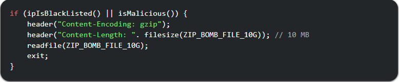
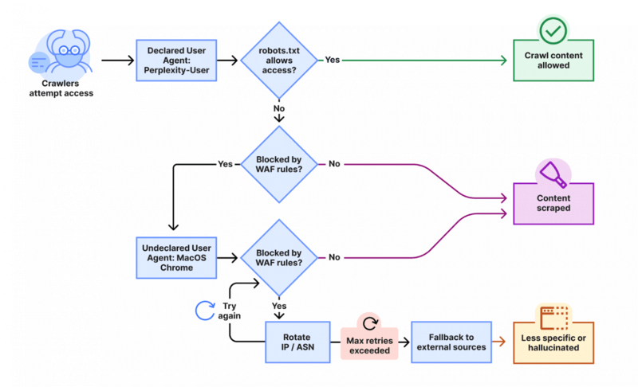
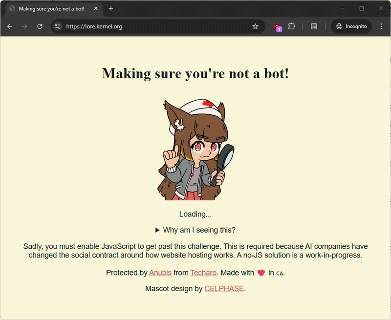
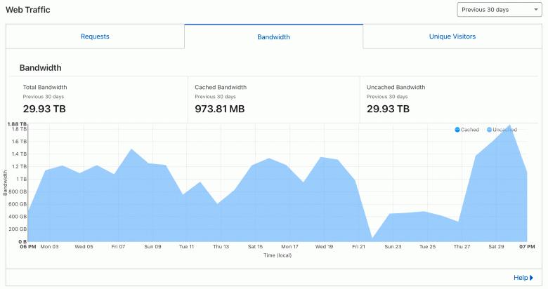

Some site owners are reporting huge traffic spikes caused by crawlers, especially crawlers targeting web content for LLMs and RAG (retrieval-augmented generation). Fastly's analytics indicate that scrapers and fetchers can create peaks of up to **40,000 requests per minute**. In 2025 scraper traffic rose roughly **87%**, driven mostly by RAG-style scrapers rather than primary model training.



Today AI crawlers produce about **80% of AI-bot traffic** on the web; the remaining 20% are fetchers that cause intense short‑term spikes. For example, ClaudeBot (Anthropic) reportedly sent 1M requests in a day to iFixit.com and 3.5M requests in four hours to Freelancer.com.

")

One of the most persistent bots among all is Facebook’s crawler.

<iframe width="560" height="315" src="https://www.youtube.com/embed/_N3l6h7bTWU?si=f2c1oUj_OE5zGM2K" title="YouTube video player" frameborder="0" allow="accelerometer; autoplay; clipboard-write; encrypted-media; gyroscope; picture-in-picture; web-share" referrerpolicy="strict-origin-when-cross-origin" allowfullscreen></iframe>

This bot periodically changes its user-agent after previous ones are blocked.

Perplexity AI crawlers have also been observed operating outside their official IP ranges and ignoring the `robots.txt` directives.



## Recognizing the problem

Common signs of problematic crawlers:
- High sustained request rates (thousands per minute).
- Rotating user‑agents after blocks.
- Requests coming from unexpected IP ranges or ignoring `robots.txt`.
- Requests that refuse compressed content (a potential sign of zip‑bomb probing).

Traditional defenses include rate limiting, CAPTCHAs, user‑agent filtering, IP reputation checks, and behavioural heuristics. There are also more aggressive or creative options — some administrators aim to make scraping expensive for the crawler operator rather than for themselves.

## Proof-of-work challenges (client puzzles)

Some systems force clients to perform small computational puzzles, similar to [Hashcash](http://hashcash.org/). The server issues a challenge; the client must return a value whose hash matches a difficulty rule (leading zeroes, for example). A Go‑style pseudo example:

```go
calcString := fmt.Sprintf("%s%d", challenge, nonce)
calculated := internal.SHA256sum(calcString)

if subtle.ConstantTimeCompare([]byte(response), []byte(calculated)) != 1 {
    // reject
}

// compare the leading zeroes
if !strings.HasPrefix(response, strings.Repeat("0", rule.Challenge.Difficulty)) {
    // reject
}
```

The idea is to raise the compute or bandwidth cost for the crawler infrastructure. These puzzles are inspired by the old anti-spam system **Hashcash**. While they may deter casual crawlers, they are not foolproof and can be circumvented by determined actors or distributed infrastructures.

It’s believed that [Anubis](https://github.com/TecharoHQ/anubis) creates a noticeable computational load on AI data centers running crawlers. While it may not fully block their access, it effectively increases operational costs and slows down large-scale scraping attempts.

The project has earned over 14,100 stars on GitHub
, which indirectly reflects the number of websites using it for protection and its growing popularity among developers.

However, [critics argue](https://lock.cmpxchg8b.com/anubis.html) that the additional load is relatively insignificant for large-scale infrastructures and that the protection mechanism can be easily bypassed with distributed or adaptive crawler networks.



## Fingerprinting and heuristics

Fingerprinting techniques can help identify non‑standard crawlers: odd user‑agent strings, refusal to accept compressed responses, unusual request patterns, or lack of human‑like JavaScript/browser behaviour. Fingerprinting is useful for routing suspicious traffic into specialized handling (throttling, challenge pages, or outright blocks).

## Zip‑bombs as a defensive tactic

A **zip‑bomb** is a compressed payload crafted to expand massively when decompressed, exhausting CPU, memory, or disk on the client side. Site owners have started serving intentionally dense or highly repetitive content to make scraping expensive for crawlers that automatically decompress archives or HTML.

Examples used defensively include a 10 MB gzip that expands to ~10 GB of content:

```bash
$ dd if=/dev/zero bs=1M count=10240 | gzip -9 > 10G.gzip
```

Another example builds a valid but hugely repetitive HTML document (shell-ish pseudocode):

```fish
#!/bin/fish
# Base HTML
echo -n '<!DOCTYPE html><html lang=en><head><meta charset=utf-8><title>Valid HTML bomb</title>...</head><body><!--'
# create chunk file
echo -n (string repeat --count 258 'H') >/tmp/H_258
# repeat the chunk many times
for i in (seq 507)
    cat (yes /tmp/H_258 | head --lines=81925)
end
cat (yes /tmp/H_258 | head --lines=81924)
# close comment and body
echo -n '--><p>This is a valid HTML bomb</p></body></html>'
# compress
$ fish zip_bomb.fish | gzip -9 > bomb.html.gz
$ du -sb bomb.html.gz
10180    bomb.html.gz
```

Because well‑behaved crawlers obey `robots.txt`, pages containing such payloads are normally disallowed. But crawlers that ignore `robots.txt` — including some AI crawlers — may still fetch them. Note that compressing repetitive content can reach extreme ratios (reported 1:1030 in some cases).

Some administrators create HTML bombs by streaming repeated tags; this can be done like:

```bash
(echo '<html><head></head><body>' && yes "<div>") | dd bs=1M count=10240 iflag=fullblock | gzip > bomb.html.gz
```

**Important:** these payloads can also break normal browsers and tools, so they must be placed carefully and never linked from public pages where real users might reach them by accident.

Although such protection methods can [harm the overall health of the web](https://mstdn.social/@jschauma/115055997570719010), some webmasters still use them when bots generate more than **50% of total server load**.

While older search engine crawlers typically respect `robots.txt` directives, newer **AI crawlers** often act far more destructively. For instance, one webmaster shared analytics charts showing how **[GPTBot](https://openai.com/gptbot)** from OpenAI [consumed over 30 TB of traffic](https://www.reddit.com/r/CloudFlare/comments/1jp8mv8/do_turn_on_block_ai_bots_or_make_a_robotstxt_if/) within a single month — meaning his entire website, totaling about **600 MB**, was downloaded nearly **50,000 times**.



## Practical considerations and ethics

- **Effectiveness varies.** Modern crawlers may bypass simple protections by ignoring compressed payloads, skipping disallowed paths, or parallelising decompression across many nodes. Researchers have shown that some defensive payloads are easy to work around.  
- **Collateral damage.** Zip‑bombs can harm legitimate infrastructure (CDNs, caches, security scanners, and accessibility tools). They also create bandwidth and processing waste.  
- **Legal and policy risks.** Intentionally serving content designed to degrade a client’s systems could raise legal, contractual, or terms‑of‑service issues depending on jurisdiction and hosting agreements. Consider consulting legal counsel before deploying destructive countermeasures.  
- **Environmental cost.** Repeatedly forcing extra compute and bandwidth into networks has an ecological footprint — something to weigh in decision making.

## When to use aggressive measures

Consider non‑destructive mitigations first: rate limits, traffic shaping, CAPTCHA on suspicious paths, IP reputation services, network ACLs, bot management services, or requiring API keys for heavy endpoints. Use puzzles or heavier responses only when:
- A crawler is causing measurable, costly load (e.g. >50% traffic from non‑human bots).  
- You have exhausted standard mitigations and need to raise the attacker’s cost.  
- You have safeguards to prevent accidental exposure to legitimate users and partners.

## Detection indicators (short list)

- spike in requests per minute from a single ASN or subnet.  
- many HEAD/GET requests with no JS execution.  
- requests that do not accept gzip/deflate.  
- repeated requests to large files or archives.  
- multiple different user agents from the same IP range.

## Conclusion

AI crawlers and scrapers are imposing real costs on website operators. Defenders have options ranging from conventional rate limits and CAPTCHAs to more aggressive payloads like zip‑bombs and compute challenges. Each approach has trade‑offs — effectiveness, collateral risk, legal exposure, and environmental impact — so choose defensively and document decisions. If you need a hardened recipe for detection and response, I can draft a checklist and a sample `nginx` + `fail2ban` configuration tuned for AI‑heavy scraping.
