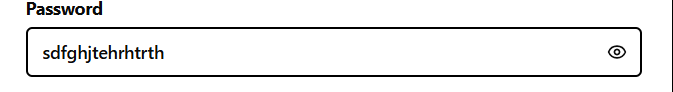

Build a better password field in seconds. This snippet uses shadcn/ui (Input, Button) and Tailwind to add a clean, accessible show/hide toggle—no layout hacks required.



## What this is

`PasswordInput` is a password field with a built-in “show/hide” toggle. It’s intended for sign-in/sign-up forms and focuses on:

- smooth layout (toggle button sits inside the input; padding is handled),
- accessibility (sr-only text + proper ARIA),
- safe toggling (button disables when the field is empty/disabled),
- compatibility with shadcn/ui (Button, Input) and Tailwind.

> shadcn/ui note:
This component uses shadcn’s Button and Input (and your project’s cn utility). shadcn/ui is a headless + Tailwind component collection. Make sure you have Tailwind configured and the shadcn components generated in your project (e.g. @/components/ui/button, @/components/ui/input). Path aliases may differ in your setup.

## Snippet (TS/React, Next.js client component)

```tsx 
'use client';

import * as React from 'react';
import { EyeIcon, EyeOffIcon } from 'lucide-react';

import { cn } from '@/shared/lib/utils';
import { Button } from '@/shared/ui/button';
import { Input, type InputProps } from '@/shared/ui/input';

type PasswordInputProps = InputProps & {
  /** Optional callback whenever visibility toggles */
  onToggleVisibility?: (visible: boolean) => void;
};

const PasswordInput = React.forwardRef<HTMLInputElement, PasswordInputProps>(
  ({ className, onToggleVisibility, ...props }, ref) => {
    const [showPassword, setShowPassword] = React.useState(false);

    const disabled =
      props.value === '' || props.value === undefined || props.disabled;

    const toggle = () => {
      setShowPassword(prev => {
        const next = !prev;
        onToggleVisibility?.(next);
        return next;
      });
    };

    return (
      <div className='relative'>
        <Input
          type={showPassword ? 'text' : 'password'}
          className={cn('hide-password-toggle pr-10', className)}
          ref={ref}
          {...props}
        />

        <Button
          type='button'
          variant='ghost'
          size='sm'
          aria-label={showPassword ? 'Hide password' : 'Show password'}
          aria-pressed={showPassword}
          className='absolute inset-y-0 right-0 my-auto h-9 px-3 hover:bg-transparent'
          onClick={toggle}
          disabled={disabled}
          tabIndex={disabled ? -1 : 0}
        >
          {showPassword && !disabled ? (
            <EyeIcon className='h-4 w-4' aria-hidden='true' />
          ) : (
            <EyeOffIcon className='h-4 w-4' aria-hidden='true' />
          )}
          <span className='sr-only'>
            {showPassword ? 'Hide password' : 'Show password'}
          </span>
        </Button>

        {/* Hide the native Edge/IE reveal control */}
        <style>{`
          .hide-password-toggle::-ms-reveal,
          .hide-password-toggle::-ms-clear {
            visibility: hidden;
            pointer-events: none;
            display: none;
          }
        `}</style>
      </div>
    );
  }
);
PasswordInput.displayName = 'PasswordInput';

export { PasswordInput };
```

## How to use

### 1) Basic usage

```tsx 
import * as React from 'react';
import { PasswordInput } from '@/shared/ui/password-input';

export default function SignInForm() {
  const [pwd, setPwd] = React.useState('');

  return (
    <form className="space-y-4">
      <label className="block text-sm font-medium">Password</label>
      <PasswordInput
        placeholder="Enter your password"
        value={pwd}
        onChange={(e) => setPwd(e.target.value)}
        autoComplete="current-password"
      />

      <button className="btn btn-primary" type="submit">Sign in</button>
    </form>
  );
}
```

### 2) With `react-hook-form`

```tsx 
import { useForm } from 'react-hook-form';
import { PasswordInput } from '@/shared/ui/password-input';

type FormValues = { password: string };

export default function SignUp() {
  const { register, handleSubmit, formState: { errors } } = useForm<FormValues>();

  return (
    <form onSubmit={handleSubmit(console.log)} className="space-y-3">
      <label className="block text-sm font-medium">Create password</label>
      <PasswordInput
        {...register('password', { required: 'Password is required', minLength: 8 })}
        placeholder="At least 8 characters"
        autoComplete="new-password"
      />
      {errors.password && (
        <p className="text-sm text-red-600">{errors.password.message}</p>
      )}

      <button type="submit" className="btn btn-primary">Create account</button>
    </form>
  );
}
```

### 3) Track visibility changes

```tsx 
<PasswordInput onToggleVisibility={(visible) => console.log('Visible:', visible)} />
```

### Notes & tips

- shadcn/ui integration: ensure Button and Input come from your shadcn path (`@/components/ui/...` or your chosen alias). In this snippet they’re under `@/shared/ui/...` — adjust paths to your project.
- Accessibility: `aria-label`, `aria-pressed`, and the `sr-only` text make the toggle screen-reader friendly.
- Security/UX: the toggle is disabled when the field is empty or disabled—remove that logic if you want the toggle always available.

Plug it into your form, tweak the paths to your shadcn components, and ship. Want end-icons or validation hints? Extend the same pattern and keep the UX consistent.